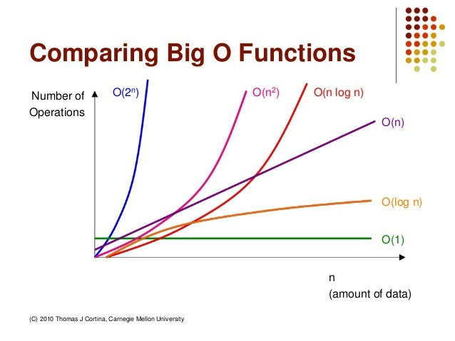

# 자료구조와 알고리즘

## 자료구조와 알고리즘의 관계
자료구조와 알고리즘은 데이터와 그 데이터를 처리하는 방법의 관계이다.
- 자료구조가 요리 재료이면 알고리즘은 요리법
- 자료구조가 자동차 부품이면 알고리즘은 자동차 조립 방법
  - 프로그래밍 언어가 자동차 조립이라면 소프트웨어는 완성된 자동차

|개념|분야|목적|내용||
|---|---|---|---|---|
|**자료구조**|컴퓨터 분야|효율적으로 접근 및 수정할 수 있도록|자료(데이터)를 구성, 관리, 저장하는 것|자료(데이터)|
|**알고리즘**|컴퓨터, 수학등|어떤 문제를 해결하기 위한|일련의 단계적인 절차 or 방법|자료(데이터)를 처리하는 방법|

## 자료구조
컴퓨터 프로그래밍 언어에서 효율적인 자료(데이터)의 형태
- 동일한 데이터도 효율적인 자료구조에 저장함으로써 효율적으로 관리 가능
- 자료구조의 종류는 크게 단순 자료구조, 선형 자료구조, 비선형 자료구조, 파일 자료구조가 있다.
  
### 1. 단순 자료구조
프로그래밍 언어의 데이터 형식에 해당하는 정수, 실수, 문자, 문자열
- 정수 : 소수점 X. int or integer 형태.
- 실수 : 소수점 O. float 등으로 표현
- 문자 : 한 글자를 의미. char로 표현
- 문자열 : 글자 여러개를 연결한 것. string으로 표현

### 2. 선형 자료구조
데이터를 한 줄로 순차적으로 표현한 형태
- 선형 리스트, 연결 리스트, 스택, 큐 등

### 3. 비선형 자료구조
하나의 데이터 뒤에 여러 개가 이어지는 형태
- 트리, 그래프 등

### 4. 파일 자료구조
파일 내용이 디스크에 저장되는 방식에 따라 순차 파일과 직접 파일로 구분
* 순차 파일(Sequential File)
  - 파일 내용을 논리적인 처리 순서에 따라 연속해서 저장하는 것
  - 구조가 간단하기에 저장되는 공간 효율이 높음
  - 다른 내용을 추가, 삭제할 경우 파일 내용을 재구성해야 함 => 시간이 오래 걸림
* 직접 파일(Direct File)
  - 파일 내용을 임의의 물리적 위치에 기록하는 방식
  - 직접 접근 방식(Direct Access Method)
  - 내용을 저장하는 위치를 해시(Hash) 함수라는 계산식으로 결정
* 색인 순차 파일
  - 순차 파일과 직접 파일이 결합된 형태

## 알고리즘
어떤 문제를 해결해 가는 논리적인 과정
- 정렬, 검색, 재귀 등

### 알고리즘 표현법
#### 1. 일반 언어 표현
- 일반적인 자연어를 사용해서 설명하듯이 알고리즘 표현
  - 자연어 : 사람들이 일상적으로 쓰는 언어
  - 기계어(인공어) : CPU가 직접 해독하고 실행할 수 있는 비트 단위로 쓰인 컴퓨터 언어
- 일반 사람이 이해하기 쉽게 표현 가능
- 최종적으로 코드로 변경하는데 한계가 있음
- 어떤 알고리즘을 사용해야 할지 아이디어가 떠오르지 않을 때, 생각 범위를 넓히도록 사용하는 정도로 사용

#### 2. 순서도를 이용한 표현
- 여러 종류의 상자와 상자를 이어주는 화살표를 이용해서 명령 순서를 표현
- 간단한 알고리즘은 쉽게 표현 가능
- 복잡한 알고리즘은 표현하기 어려운 경우가 많음
- 실무에서는 순서도를 그리는 경우가 드물다. 순서도로 표현가능한 간단한 알고리즘은 순서도 없이 해결할 수 있는 경우가 많다.

#### 3. 의사(pseudo)코드를 이용한 표현
- Pseudo : 가짜의
- 프로그래밍 언어보다는 좀 더 자연어에 가까운 형태
- 프로그램 코드와 자연어의 중간 형태
- 사용 이유
  - 프로그램 코드를 직접 코딩하는 것보다 알고리즘을 좀 더 명확하게 정립하는데 도움이 됨
  - 코드에 따로 설명을 달지 않아도 이해하는 데 무리가 없음
    - 다른 개발자들이 쉽게 이해할 수 있는 형식으로 사용
  - 나중에 코드 입력, 테스트, 디버그 수정 단계에서 작업하는 것보다 의사코드 설계 단계에서 미리 오류를 수정하는 것이 경제적

#### 4. 프로그램 코드로 표현
- 실제로 사용하는 프로그래밍 언어의 코드로 바로 작성하는 것도 가능하다.

#### 5. 혼합 형태
- 간단한 알고리즘은 직접 코드로 작성
- 복잡한 알고리즘은 일반언어, 순서도, 그림, 의사코드 등을 종합적으로 활용해서 표현

### 알고리즘의 성능
* 시간 복잡도(Time Complexity)
  - 알고리즘을 소요 시간(연산 수)을 기준으로 알고리즘 성능을 측정/분석하는 방법
  - 데이터 개수에 따라 시간이 어떻게 변하는지 그래프로 표현
  - 정확한 소요 시간에 대해서는 컴퓨터의 성능차이가 있다. 시간을 연산수로 이해하면 좋다.
* 빅-오 표기법(Big Oh Notaion)
  - 알고리즘의 성능 표기
  - $O(f(n))$  형태
  - 
  - 대표적인 함수 : $O(1)$, $O(log_{n})$, $O(n)$, $O(n log_{n}))$, $O(n^{2})$, $O(n^{3})$, $O(2^{n})$
  - 입력 데이터의 개수에 따라 적절한 알고리즘을 선택하게 된다.
    - 빠른 알고리즘은 구현하는 시간이 걸리기 때문에 실무에서 무조건 사용하지는 않는다.
  