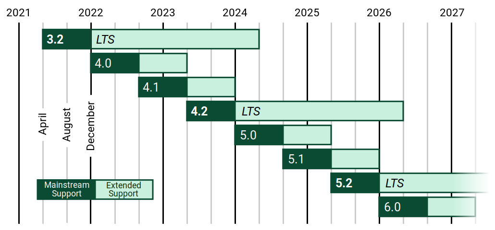
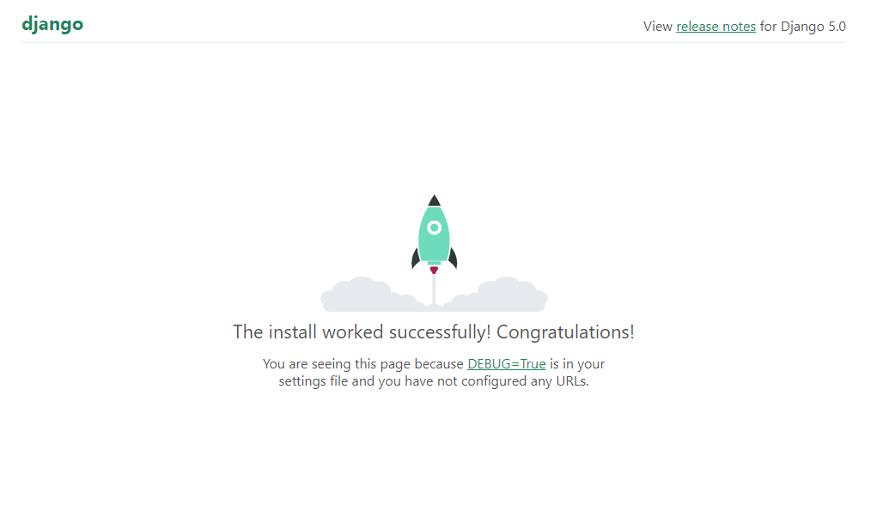
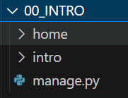
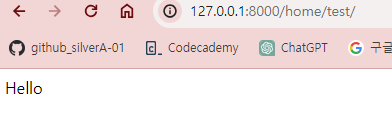
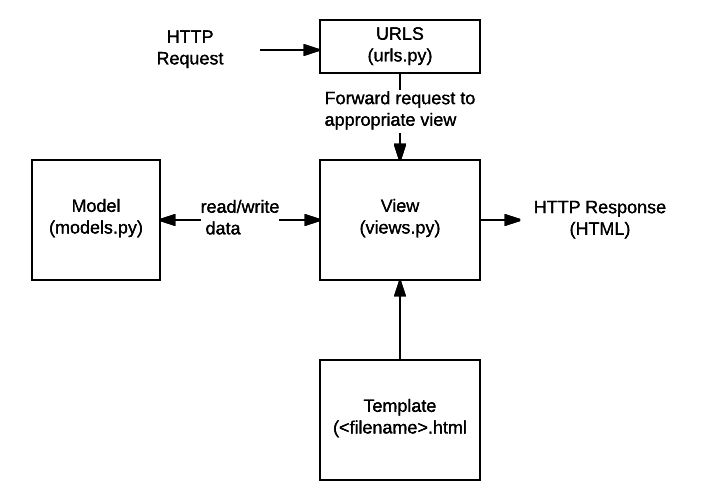
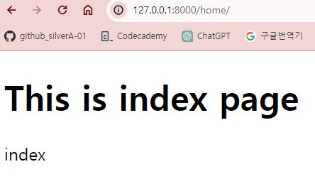

# Django Basic
## Django란?
장고(Django)는 파이썬으로 작성된 오픈 소스 웹(web) 프레임워크(Framework)이다.
- 웹 서비스 개발을 위해 사용
- 쉽고 빠르게 웹 사이트를 만들 수 있다.

> **※참고**
>
> [Django 홈페이지 카테고리 중 다운로드](https://www.djangoproject.com/download/)에서 버전별 지원 로드맵을 확인할 수 있다. 안정적으로 오래 서비스되는 LTS 버전을 로드맵에서 확인 후 사용하는 것을 추천한다.
> 

### 프레임워크(Framework)
프레임워크는 어떤 종류의 Application을 개발할 때 사용하는 도구나 틀로, 소프트웨어 개발에 있어 하나의 뼈대 역할을 한다.
1. 일반적으로 발생하는 문제를 해결한다.
2. 일관된 방식으로 작업을 수행하도록 돕는다.

프레임워크는 A to Z로 원래 코드를 짜야하는 일을 쉽게 작업할 수 있도록 도와주는 도구로서 역할을 하는데, 수행하는 역할이 정해져있고 프레임워크를 사용하기 위해 제약이 존재한다. 즉, 프레임워크가 규정한 제약에 사용자가 따라야한다는 특징이 있다.

**컴퓨터 언어별 대표적인 웹 프레임워크**

|언어|웹 프레임워크|많이 사용하는 국가|
|---|---|---|
|Python|Django|ko|
|Java|Spring|ko|
|Ruby|Rails|jp|
|Java Scripts|Express.koa|ko|
|PHP|Laravel||

### 라이브러리와 프레임워크의 비교
라이브러리(Library)는 완전한 프로그램이 아닌, 특정한 부분 기능만을 수행하도록 제작된 코드 조각이나 함수들의 모음이다. 

프레임워크는 여러 기능을 가진 클래스와 라이브러리가 '특정 결과물을 구현하고자' 합쳐진 형태라고 볼 수 있다.

라이브러리와 프레임워크를 사용하면 흔히 필요한 기능을 처음부터 다시 작성할 필요 없이 해당 기능을 빠르게 구현할 수 있다.

여러가지 라이브러리 기능 중 사용자가 필요한 부분만 선택해서 사용할 수 있고, 사용하기 위한 제약이 없는 편이다. 반면에, 프레임워크는 제어권이 프레임워크에게 있어 사용자가 이를 따라야한다.

보통 이러한 커다란 흐름으로 라이브러리와 프레임워크를 구분할 수는 있으나, 둘의 차이를 엄밀히 말하는 것은 불가능에 가깝다. 개념에서 조금 벗어나더라도 제작자가 선언하기에 따라 라이브러리, 프레임워크로서 지정되는 경우가 있다는 점을 참고하여 대략적인 경향정도만 파악하면 된다.
   


## Django 설치
터미널에서 아래 코드를 입력해 Django를 설치한다.
```bash
$ pip install django
```

## Django 프로젝트 생성
장고는 웹 프레임워크로서 웹 서버 구축을 위해 하나의 프로젝트를 생성한다.
### `intro`라는 이름의 프로젝트를 생성하기
터미널에서 프로젝트를 생성할 특정한 경로로 이동 후, 아래 코드를 입력해 Django의 프로젝트를 생성한다.
```bash
$ django-admin startproject intro
```

생성된 프로젝트 내부는 아래와 같이 구성된다.


1. 프로젝트 내부에는 프로젝트를 관리/수정 작업을 할 수 있는 `manage.py`이 자동으로 생성된다.
   > [manage.py 관련 설명 문서](https://docs.djangoproject.com/ko/3.0/ref/django-admin/)
2. 프로젝트의 하위 디렉토리로 프로젝트 이름과 같은 `intro`라는 프로젝트를 총괄해주는 마스터 폴더가 자동으로 생성된다. 
프로젝트의 정보 및 설정 등을 관리할 수 있는 파일들이 자동 생성된다. 프로젝트 폴더명은 변경해도 괜찮지만, **마스터 폴더명은 수정하지 않는 것을 권장한다.** 이름으로 세팅된 기본 값들이 있기 때문이다.
   - `__init__.py` : **패키지**로서 작동하기 위해 생성된 파일. 내용은 비어있다.
   - `asgi.py` : 비동기 SGI 관련. 비동기는 동시에 똑같이 진행되지 않는다는 뜻이다. 
     - Asynchronous(비동기) Server Gateway Interface
     - SGI는 개발보다는 배포할 때 사용된다.
   - `wsgi.py` : 웹(Web) SGI 관련
   - `settings.py` : 설정과 관련된 파일
     - 참고로 **'Configuration'**(구성)과 관련된 `conf`, `config`는 설정을 의미하는 단어라는 것을 알아두자.
   - `urls.py` : url들의 path를 관리하는 파일
     - 페이지(URL) 요청이 발생하면 가장 먼저 호출된다.

장고 프로젝트는 마스터 파일/폴더와 여러 APP들의 집합이다.

- 장고에서 프로젝트를 새로 생성했을 때는 1, 2와 같이 프로젝트를 관리할 수 있는 마스터 파일/폴더가 생성된다. 
- 웹 서버와 직접적으로 관련된 작업 폴더(=APP)는 사용자가 따로 프로젝트 내부에서 생성해야 한다.(아래 `3.APP 폴더 생성`에서 계속)

## `settings.py` 설정 및 구조
`settings.py` 파일은 장고의 프로젝트 환경 설정하는 파일이다.

### 1. `BASE_DIR`
현재 파일(`settings.py`)이 있는 경로의 부모(`intro` 마스터 폴더)의 부모(`intro` 프로젝트 폴더)를 의미하는 것으로, **프로젝트 폴더**를 의미한다. 
```python
BASE_DIR = Path(__file__).resolve().parent.parent
```
- `__file__` : 이 단어가 사용되고 있는 `settings.py` 파일 스스로를 의미
- `Path` : 경로
- `parent` : 부모

ALL CAP으로 작성된 `상수`이기 때문에 `BASE_DIR`이라는 변수를 만들어 재할당하지 않도록 주의한다.
- `상수`는 변하지 않는 변수명으로 지정한 것이다. 전부 대문자(ALL CAP)로 변수명을 지었다면 상수라는 것을 알 수 있다.
     - ALL CAP으로 변수명을 지은 것이 상수라고 인식하는 것은 관례나 규칙같은 것이다.

### 2. `SECRET_KEY`
실제로 웹을 운영할 때 조심해야 할 KEY

### 3. `DEBUG` : 개발모드(디버그 모드) 설정
- DEBUG는 버그를 찾기 위해 사용하는 기능이다.
```python
DEBUG = True
```
   - 개발 모드일 때, `DEBUG = True`로 설정한다.
     - 서버 실행시 404 오류인 경우 `urls.py` 파일에 설정한 내용들이 자세히 노출되는 것을 볼 수 있다.
   - 운영 모드일 때, `DEBUT = False`로 설정한다.
     - 서버 실행시 404 오류인 경우 단순한 오류페이지만 보이고 자세한 에러 메세지 정보는 노출되지 않게 된다.

### 4. `ALLOWED_HOSTS`
```python
ALLOWED_HOSTS = []
```
운영 모드에서 배포 작업을 할 때 사용한다. 서버에 접속할 수 있는 도메인과 IP를 받았을 경우 관련 내용을 등록한다.

### 5. `INSTALLED_APPS` 
실제로 작업과 관련하여 설치된 APP들을 등록하는 리스트이다.
```python
INSTALLED_APPS = [
    'django.contrib.admin',
    'django.contrib.auth',
    'django.contrib.contenttypes',
    'django.contrib.sessions',
    'django.contrib.messages',
    'django.contrib.staticfiles',
]
```
  - 현재 리스트에 들어간 요소들은 프로젝트 생성시 자동으로 **기본 설치되어 있는 APP들** 이다.
  - 기본 설치 APPS, 3rd Party APPS, Local APPS을 구분해서 리스트에 추가하는 것이 좋다.
    - **3rd Party App**은 `pip`로 설치한 APP, 즉 외부 라이브러리 앱을 의미
    - **Local APP**은 장고에서 직접 생성한 앱을 의미
  - 3rd Party Apps 설치 후 혹은 Local Apps 생성 후에는 반드시 `settings.py`의 `INSTALLED_APPS`의 리스트에 관련 Apps를 등록해야 작동한다.
  - APP을 추가작성한 마지막에 **Trailing Commas(`,`)** 를 작성해줘야 한다.
    - 트래일링 콤마는 새로운 요소를 추가하고 콤마(`,`)를 미리 작성하는 것으로, 다음 요소를 추가할 때 이전 요소에 콤마를 작성하지 않는 오류를 막기 위해 적는 것이다.
> 아래 예시처럼 구분해서 추가하는 것을 습관화하자.
```Python
INSTALLED_APPS = [
    'django.contrib.admin',
    'django.contrib.auth',
    'django.contrib.contenttypes',
    'django.contrib.sessions',
    'django.contrib.messages',
    'django.contrib.staticfiles',

    # 3rd Party APPS
    'django.extensions',

    # Local APPS
    'utils',
]
```

### 6. `MIDDLEWARE`
서버가 응답해야하는 클라이언트의 요청에 대한 **필터링 작업**과 관련
- 보안(security), 해킹(clickjacking) 등과 관련된 내용도 포함
```python
MIDDLEWARE = [
    'django.middleware.security.SecurityMiddleware',
    'django.contrib.sessions.middleware.SessionMiddleware',
    'django.middleware.common.CommonMiddleware',
    'django.middleware.csrf.CsrfViewMiddleware',
    'django.contrib.auth.middleware.AuthenticationMiddleware',
    'django.contrib.messages.middleware.MessageMiddleware',
    'django.middleware.clickjacking.XFrameOptionsMiddleware',
]
```

### 7. `ROOT_URLCONF`
최상위(`ROOT`) URL 설정(`CONF`)
```python
ROOT_URLCONF = 'intro.urls'
```
- `'intro.urls'`에서 `intro`는 `settings.py` 파일이 있는 마스터 폴더 `intro`를 뜻한다.
- `ROOT_URLCONF = 'intro.urls'`는 마스터 폴더인 `intro` 안의 `urls.py`라는 폴더가 최상위 URL로 설정했다는 의미이다.
> `intro` 폴더 안의 `urls.py`를 나타내고 싶을 때, CLI와 파이썬에서 파일과 폴더를 구분하는 방법에 차이가 있다.
> 
> - CLI에서는 `intro/urls.py` 처럼 파일과 폴더를 구분
> - 파이썬에서는 `intro.urls`로 파일과 폴더를 구분

### 8. `TEMPLATES` 
Django template 관련 경로나 정보를 설정
   -  template : 데이터를 사용자에게 보여주는 컴포넌트
   -  실제로 보여지는 것과 관련되어 있다.
   -  HTML 관련
```python
TEMPLATES = [
    {
        'BACKEND': 'django.template.backends.django.DjangoTemplates',
        'DIRS': [],
        'APP_DIRS': True,
        'OPTIONS': {
            'context_processors': [
                'django.template.context_processors.debug',
                'django.template.context_processors.request',
                'django.contrib.auth.context_processors.auth',
                'django.contrib.messages.context_processors.messages',
            ],
        },
    },
]
```
- 장고에서 template에 접근하는 방식은 다음과 같다.
  - 5번에서 말한 `INSTALLED_APPS` 에 등록된 APP 내의 `templates` 폴더 내부의 html 문서를 차례대로 순회하며 해당하는 html을 찾는다.


### 9. `DATABASES` 
데이터베이스 엔진의 연결 설정
```python
DATABASES = {
    'default': {
        'ENGINE': 'django.db.backends.sqlite3',
        'NAME': BASE_DIR / 'db.sqlite3',
    }
}
```
   - 장고를 설치하면 기본적으로 `sqlite`(RDBMS_관계형 데이터베이스 관리 시스템)가 설치된다. `sqlite`의 정보를 설정할 수 있다.
   - Local APP을 생성한 후 APP 내부의 `models.py`에 데이터베이스의 Table과 연결할 클래스를 정의해주면 프로젝트 폴더(`BASE_DIR`) 내부에 `db.sqlite3`가 생성된다.

### 10. `AUTH_PASSWORD_VALIDATORS`
사용자 패스워드(비밀번호) 유효성 검사를 어떻게 할지 설정
- Validate : 유효한
- Validation : 유효(사용가능, 효과가 있음). 유효성 검사
- Validator : 유효성 검사기. 필드에 특정한 제약 조건을 걸어두는 것.
```python
AUTH_PASSWORD_VALIDATORS = [
    {
        'NAME': 'django.contrib.auth.password_validation.UserAttributeSimilarityValidator',
    },
    {
        'NAME': 'django.contrib.auth.password_validation.MinimumLengthValidator',
    },
    {
        'NAME': 'django.contrib.auth.password_validation.CommonPasswordValidator',
    },
    {
        'NAME': 'django.contrib.auth.password_validation.NumericPasswordValidator',
    },
]
```
- `UserAttributeSimilarityValidator` : 사용자 아이디와 패스워드가 같은지 검사
- `MinimumLengthValidator` : 패스워드 최소 길이 검사
- `CommonPasswordValidator` : 너무 일반적인 패스워드로 구성되어 있는지 검사
- `NumericPasswordValidator` : 숫자로만 이루어져있는지 검사
### 11. 언어 및 시간 설정
```python
LANGUAGE_CODE = 'en-us'

TIME_ZONE = 'UTC'

USE_I18N = True

USE_TZ = True
```
- 한글을 기본언어로 바꾸고 싶다면 `LANGUAGE_CODE = 'ko'`로 수정한다.
- `TIME_ZONE = 'UTC'` : 세계 표준 협정시로 시간을 저장
  - `TZ`는 TimeZone의 약자로 `UTC`는 세계 표준 협정시를 의미
- `USE_TZ = True`는 장고가 자동으로 TIME에 따라 시간을 계산한다는 의미이다.
  - 한국 시간으로 설정하고 싶다면 `USE_TZ = False`로 수정하고 `TIME_ZONE = 'Asia/Seoul'`로 수정하면 된다.
- `USE_I18N = True` : 국제화를 하겠다는 의미
  - `I18N`은 Internationalization(국제화)의 약자이다. (18은 문자 길이를 줄였다는 의미)
  - 참고로 `L10N`은 Localization(현지화)의 약자이다. (10은 문자 길이를 줄였다는 의미)

### 12. `STATIC_URL`
정적(static) 파일에 대한 관리 및 URL을 설정
- CSS, Java Script, image과 같은 파일을 `static file`이라고 한다.
```python
STATIC_URL = 'static/'
```
  
### 13. `DEFAULT_AUTO_FIELD`
기본적인 숫자 필드에 대한 내용으로, `AUTO`는 숫자(자동으로 올라가는 숫자)를 의미한다.
```python
DEFAULT_AUTO_FIELD = 'django.db.models.BigAutoField'
```

## Django 프로젝트 실행하기
프로젝트명이 마스터 파일명과 같아서 경로가 헷갈릴 수 있기 때문에, 편의상 프로젝트명을 `00_INTRO`로 변경해주었다.
- 위에서도 언급했지만, 관련된 세팅에 오류가 날 수 있기 때문에 마스터 파일 `intro`는 이름을 변경하지 않는 것을 권장한다.
- 프로젝트명은 변경해도 문제가 없다.

터미널 경로가 프로젝트 파일 `00_INTRO` 경로에서 아래 코드로 프로젝트를 실행할 수 있다.
```bash
$ python manage.py runserver
```
터미널에서 코드를 실행하면 아래와 같은 안내 메세지가 나온다.
```bash
You have 18 unapplied migration(s). Your project may not work properly until you apply the migrations for app(s): admin, auth, contenttypes, sessions.
Run 'python manage.py migrate' to apply them.

January 05, 2024 - 10:32:35
Django version 5.0.1, using settings 'intro.settings'
Starting development server at http://127.0.0.1:8000/
Quit the server with CTRL-BREAK.
```
아직 세팅되지 않는 부분에 있어서 경고문이 있지만 지금은 무시한다. 프로젝트 관련해 생성일, 세팅과 관련된 파일(`'intro.settings'`)설명이 있다. `http://127.0.0.1:8000/`는 작업하고 있는 서버 도메인으로, 앞으로 도메인 뒤에 `url`이 추가로 들어가게 된다. 제대로 서버가 실행되었는지 `http://127.0.0.1:8000/`를 브라우저에서 열어 확인할 수 있다. 

아래 이미지와 같이 로켓과 성공했다는 문장을 본다면 정상적으로 서버가 작동하는 것이다.



서버를 실행한 후에는 관련된 작업에 대해 터미널에서 log가 계속 업데이트 된다. 아래는 서버에 접속했다는 log이다. Django 프로젝트 내에서 변경 사항을 저장할 경우 관련된 기록도 log가 남는다.
```bash
[05/Jan/2024 10:35:16] "GET / HTTP/1.1" 200 10629
Not Found: /favicon.ico
[05/Jan/2024 10:35:16] "GET /favicon.ico HTTP/1.1" 404 2109
```
## Local APP 생성하기
### 프로젝트에 `home` APP 생성하기
`00_INTRO` 프로젝트 내에 `home`이라는 이름의 APP(작업 폴더)을 생성하려면, 터미널 프로젝트 파일 경로에서 아래 코드를 실행한다.
```bash
$ python manage.py startapp home
```
아래 이미지처럼 `home`이라는 이름의 APP이 생성되었다.



### `intro.settings.py`에 APP 등록하기
APP을 생성하면 제일 먼저 해줘야하는 작업은 `intro.settings.py`에 생성한 APP을 등록하는 것이다. 

`intro.settings.py`에서 `INSTALLED_APPS`에 생성한 APP을 등록해준다. APP을 등록하고 마지막에 트래일링 콤마(`,`)를 넣어주는 것도 잊지말자.
```python
INSTALLED_APPS = [
    'django.contrib.admin',
    'django.contrib.auth',
    'django.contrib.contenttypes',
    'django.contrib.sessions',
    'django.contrib.messages',
    'django.contrib.staticfiles',

	'home',
]
```

## ROOT URL
`home` APP이 제대로 작동하기 위해서는 먼저 `home` APP과 관련된 URL 설정이 필요하다. 먼저 `home` APP 폴더에 `urls.py` 파일을 생성해준다. 

`home.urls`에서 URL과 관련된 설정을 해도 서버에서 정상적으로 작동하지 않는다. 클라이언트의 요청(URL)에 대해 서버가 응답을 해야하는데, 요청과 관련된 URL에 대해 가장 먼저 접근되는 것이 **최상위(ROOT) URL**이다. `home.urls`은 ROOT URL이 아니기 때문에 먼저 ROOT URL에서  `home.urls`로 받은 요청을 전달할 수 있는 경로 설정을 추가해줘야 한다. 이를 포워딩(Forwarding)이라고 하며 말 그대로 최상위 URL에서 특정 URL로 Forward(건내주기)한다는 의미이다.

`settings.py` 7번에서 `intro.urls`이 ROOT URL로 설정되어 있음을 확인했다.

### ROOT URL인 `intro.urls` 살펴보기
프로젝트 생성시 자동으로 생성된 `intro.urls` 파일을 확인해보자. 파일에 작성된 코드는 아래와 같다.
```python
from django.contrib import admin
from django.urls import path

urlpatterns = [
    path('admin/', admin.site.urls),
]
```

1. 첫 번째 인자로 오는 `route`에는 도메인 이후에 올 문자열(`string`)로 이루어진 URL 패턴이 들어간다. 

### 1. ROOT URL에서 `home.urls`에 관련된 포워딩 작업
도메인 뒤에 오는 URL 경로(path)가 `home/`일 경우에 `home.urls`로 전달받아 `home` APP에서 필요한 응답하도록 설계하려고 한다.
```python
from django.contrib import admin
from django.urls import path
from django.urls import include

urlpatterns = [
    path('admin/', admin.site.urls),
    path('home/', include('home.urls'),
]
```
1. `include()` 함수를 사용하여 포워딩 작업을 할 수 있도록 `from django.urls import include`를 코드에 작성해준다.
2. `urlpatterns`에서 리스트 내 요소로 `path('home/', include('home.urls'),`를 추가해 포워딩 경로를 설정해준다.
   - `path()` 함수는 순서대로 `route(경로)`와 `view`를 인자(argument)로 필수적으로 필요하다. `route(경로)`에는 URL pattern에 들어갈 문자열이 들어간다. 경로에 대해 접근했을 때 `view` 인자로 들어가는 함수가 실행된다.
   - 도메인 뒤 URL로 `home/`이 올 경우, 즉 현재 서버에서는 `http://127.0.0.1:8000/home/`으로 요청을 받을 경우 `'home.urls'`을 참조하여 응답하도록 포워딩한 것이다.


### 2. 포워딩된 `home.urls`에 `urlpatterns` 작성
도메인 뒤 `home/`으로 URL 요청이 들어온 경우 `intro.urls`에서 포워딩하여 `home.urls`에서 그 뒤의 URL 경로(path)에 대해 지정할 수 있다.

`home.urls`은 `home` APP 생성후 새로 생성한 파일이기 때문에 아래와 같이 코드를 적어준다.
```python
from django.urls import path

urlpatterns = [

]
```
1. `urlpatterns`는 포워딩 받은 URL(`home/`) 뒤에 적힐 URL과 관련하여 경로(path)설정을 위해 필요하다.
2. `urlpatterns`에서 `path`를 받기 위해 `from django.urls import path`로 `path`를 불러오는 코드 작성이 필요하다.
3. `urlpatterns` 리스트 요소로 받을 `path()` 함수는 첫 번째 인자로 `route(경로)`, 두 번째 인자로 `view`가 필요하다.
  - ```python
    path('<url명/>', <해당 경로의 url 요청시 실행할 함수>)
    ```
    1. `route(경로)` 인자 : 현재 파일은 `intro.urls`에서 설정한 `'home/'`이라는 URL pattern을 포워딩 받은 상태이다. 이 뒤에 이어질 urlpattern을 문자열로 넣어주면 된다.
    2. `view` 인자 : 함수는 해당 경로의 url로 요청되었을 때, 어떤 작업을 할지 정의한 함수가 들어간다. `views.py`는 Local App `home`에 관련된 함수를 정의하는 파일로, `home.views`에 정의한 특수한 함수를 가져오는 작업을 해야한다.

## `home.views`에 함수 정의
`home.views`에서 `test`함수를 실행하면 'Hello'라는 문자열이 return 되도록 정의했다.
```python
from django.shortcuts import render
from django.http import HttpResponse

def test(request):
  return HttpResponse('Hello')
```
- 'test'라는 함수명은 임의로 정한 것이기 때문에 바꾸어도 상관없다.
  - 일정한 규칙을 가지고 함수명을 정의하면 여러가지 함수를 정의해도 알아보기 편하다. 요청되는 URL명과 일치하도록 함수명을 정의해주었다.
- 해당 프로젝트 서버를 실행했을 때, 브라우저에서 문자열이 보이기 위해서는 `HttpResponse()`를 사용해주어야 한다. `from django.http import HttpResponse`로 해당 기능을 불러온 후 사용해주었다.
- 함수를 정의할 때 반드시 인자로 `request`를 받아줘야 한다. 이는 장고에서 함수를 정의할 때 지켜야하는 규칙이다.

## `home.urls`에서 URL 경로 설정
`home.views`에서 `test` 함수를 정의해주었으니 `home/test/`라는 URL로 요청을 받았을 때 `test` 함수를 실행하도록 `home.urls`에서 코드를 작성하겠다.
```python
from django.urls import path
from . import views

urlpatterns = [
  path('test/', views.test),
]
```
### 1.`path`의 첫 번째 인자 - `route` : urlpattern 의 문자열
  - 현재 ROOT URL에서 `'home/'` URL로 요청이 오면 `home.urls`로 포워딩 된 상태이다. 따라서 `'home/test/'`라는 URL로 요청을 받았을 때 `test` 함수가 실행되도록 하려면 `home.urls`의 `path` 첫 번째 인자로 `'test/'`만 적어주면 된다.
### 2. `from . import views`
   - `home.views`에 있는 `test`함수를 실행하려면 `home.urls`에서 `home.views`를 불러오는 작업을 해야한다. `home.views`는 모듈로서 불러올 수 있다. `from . import views`는 현재 파일이 있는 경로(`.`)에 있는 `views.py` 모듈을 불러온다는 의미이다.
### 3. `path`의 두 번째 인자 - `view` : `route`에 대한 URL 요청시 실행될 함수
   - `path`의 두 번째 인자로 `route`에 대한 URL 요청시 실행될 함수를 작성한다. `views.test`는 `views.py` 모듈의 `test` 함수를 실행한다는 의미이다.
### 4. 컴파일링 콤마 작성
  - `path` 작성이 완료되면 마지막에 컴파일링 콤마(`,`)를 작성해준다.

### 5. 서버 실행 후 `home/test/` URL 입력 후 확인
위 코드와 같이 작성하면 `home/test/`라는 URL로 요청을 받았을 때 `test` 함수를 실행된다. 서버 실행 후, 브라우저에서 `http://127.0.0.1:8000/home/test/`를 URL 창에 입력하면 아래와 같이 Hello 페이지에 보이는 것을 확인할 수 있다.



## 특정 URL로 요청시 특정한 HTML 문서로 응답하기
웹 서버는 특정한 URL로 요청시 HTML 문서로 응답해야 한다. 

이번에는 `home/` URL로 요청시 `index.html` 문서로 응답할 수 있도록 설계해보자.

### Django MTV 디자인 패턴

html 문서를 생성하기 전 HTML 문서를 넣어줄 `templates` 폴더를 만들어야 한다. 장고는 MTV(Model Template View) 디자인 패턴을 따르기 때문이다.

1. Model(모델)
- 모델은 **DB(DataBase_데이터베이스)에 저장되는 데이터**를 의미한다. 모델은 class로 정의되며 하나의 class가 하나의 DB Table이다. 장고에서는 파이썬 언어를 사용하고, DB에서는 SQL 언어를 사용하기 때문에 장고에서 ORM(Object Relational Mapping)기능을 지원하기 때문에 파이썬 코드로 DB를 조작할 수 있다. 모델에 관련된 내용은 추후 모델과 관련된 파트에서 다시 다루도록 하겠다.

2. Template(템플릿)
- 템플릿은 사용자에게 보여지는 화면을 의미한다. 장고는 View에서 로직을 처리한 후 html 파일을 context와 함께 렌더링하는데, 이 때 **html 문서**를 템플릿이라고 칭한다. 
- 장고에서는 html 문서를 찾을 때, 프로젝트 `settings`에 등록된 APP 순서대로 `templates` 폴더에서 순차적으로 html 문서를 조회한다.
- 따라서 html 문서는 각 APP 폴더에 하위폴더인 `templates` 폴더에서 생성 및 관리해야 한다.

3. View(뷰)
- **URL 요청에 대해 실행될 함수**를 정의한다.
- 요청에 따라 적절한 로직을 수행하여 결과를 템플릿으로 렌더링하며 응답한다.
- 항상 템플릿을 렌더링하는 것은 아니고, 데이터를 주고 받는 경우도 있다.
- 위에서 `test` 함수를 `home.views`에서 정의한 것도 이 때문이다.

참고로 다른 프레임워크는 보통 MVC(Model View Contoler) 디자인 패턴을 따른다. 같은 역할을 수행하더라도, 장고에서 사용하는 명칭이 다르다는 것을 유의해야 한다.

### 1. `index.html` 생성
1. `home` APP 폴더에서 `templates` 폴더 생성
   - 장고에서는 `templates` 폴더 내의 html 문서를 인식하기 때문이다.
2. 중복된 html 문서명을 탐색하지 않도록 `templates` 폴더 내부에 해당 APP 폴더 이름과 같은 이름의 폴더 생성
   - `templates`의 하위 폴더로 `home` 폴더를 생성한다.
   - 장고에서 html 문서를 조회하는 방식은 프로젝트 `settings`에 등록된 APP 순서대로 `templates` 폴더에 있는 html 문서를 순차적으로 조회한다. 
     - 현재 `home` APP과 관련된 `index.html` 문서를 생성하여 접근하려고 하는데, 추후 생성한 APP에 같은 이름인 `index.html`문서가 있을 경우 장고에서 `settings`에 등록된 APP 순서대로 `templates` 폴더를 탐색하여 우선 등록된 다른 Local APP의 `index.html`문서로 접근할 수 있다. 
   - 이를 방지하기 위해 `templates`의 하위 폴더로 `home` 폴더를 만들어 특정 경로의 html 문서를 찾아가게 하는 것이다. 
   - `templates`의 하위폴더인 `home`이라는 폴더명은 임의로 정한 것이기 때문에 변경해도 괜찮지만, 전체적으로 통일된 규칙으로 작성하는 것이 좋기 때문에 APP 이름과 같은 이름으로 작성할 예정이다.
3. 2번 `home` 폴더에서 `index.html` 생성
   - `index.html` 생성 후 원하는 내용을 작성해주면 된다.
```html
<!DOCTYPE html>
<html lang="en">
<head>
    <meta charset="UTF-8">
    <meta name="viewport" content="width=device-width, initial-scale=1.0">
    <title>Document</title>
</head>
<body>
    <h1>This is index page</h1>
    <p>index</p>
</body>
</html>
```

### 2. `home.views`에서 `index.html`을 연결할 `index` 함수 정의
```python
from django.shortcuts import render
from django.http import HttpResponse

def test(request):
  return HttpResponse('Hello')

def index(request):
  return render(request, 'home/index.html')
```
`home.views`에서  `index` 함수를 실행하면 위에서 생성한 `index.html`이 보여지도록(`render`) 정의해주었다.
1. `render` 함수는 **첫 번째 인자로 반드시 `request`를 받는다.** 이는 장고에서 사용되는 규칙이다.
2. `render` 함수는 두 번째 인자로 **렌더링할 html의 경로**를 받는다.
   - 장고에서는 자동으로 html의 문서를 `templates` 폴더에서 찾는다. 따라서 `templates` 폴더에 대한 경로는 생략되어도 된다.
   - `index.html`은 `templates/home/index.html` 경로로 있기 때문에 `home/index.html`만 작성한다.

### 3. `home.urls`에서 관련된 URL 경로 추가
```python
from django.urls import path
from . import views

urlpatterns = [
  path('test/', views.test),
  path('', views.index),
]
```
`home/` URL로 요청시 `index.html` 문서로 응답할 수 있도록 하려고 한다.
1. `home/` 이후에 받는 URL이 없다는 의미로 `path`의 첫 번째 인자로 `''`를 넣어준다.
2. `home/` URL로 요청시 `views.index` 함수를 실행하여 `index.html` 문서가 보여질 수 있도록 `views.index`를 작성한다.
   - 여기서 `index`는 `home.views`에 정의한 `index` 함수를 의미한다.

### 4. 서버 실행 후 `home/` URL 입력 후 확인
서버를 실행한 상태에서 브라우저 주소에 `http://127.0.0.1:8000/home/`를 입력하면 아래와 같이 `index.html`이 랜더되는 것을 확인할 수 있다.



