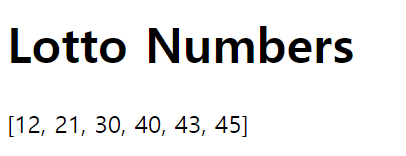
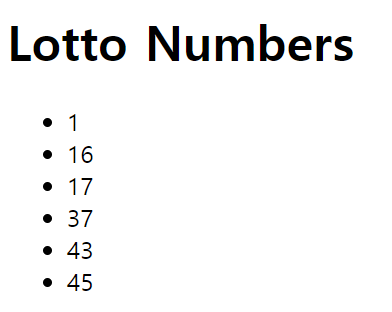

# DTL(Django Template Language)
장고에는 DTL을 통해 파이썬 코드를 html 탬플릿 안에서 활용할 수 있다.

## 1. Template 변수 : `{{ <변수> }}`
View에서 함수에서 정의한 변수를 템플릿 안에서 다룰 수 있다.

`01_django_basic.md` 문서에서 `home` APP을 생성해서 `home.views`에서 `index` 함수를  `home/templates/home/index.html` 문서를 렌더링하도록 정의해주었다.
### 1. `index` 함수 재정의
 `home.views`에서 `index` 함수의 변수를 DTL을 사용해 `index.html`에서 활용해보자. 현재 index 함수는 아래와 같이 정의되어 있다.
 ```python
from django.shortcuts import render
import random

def index(request):
    return render(request, 'home/index.html')
 ```

변수 `lotto_numbers`를 `index.html`에서 활용하기 위해서는 `render` 함수의 세 번째 인자로 context 사전형(dictionary) 객체를 넣어줘야한다. 이를 context로 넘긴다고 한다.
```python
from django.shortcuts import render
import random

def index(request):
    lotto_numbers = random.sample(range(1, 46), 6)
	lotto_numbers.sort()
    return render(request, 'home/index.html', 
    {'lotto_numbers': lotto_numbers,})
 ```
- context 사전형 객체의 value에 html 문서에서 활용하고 싶은 변수 `lotto_numbers`를 넣어준다. 
- key에는 `'lotto_numbers'`라고 임의로 작성해주었다. 이는 다른 변수명으로 사용해도 괜찮으나, 통일된 규칙으로 작성하는 것이 좋기 때문에 value에 들어가는 변수명의 문자열로 작성했다.
- 마지막에 트레일링 콤마(`,`)도 잊지않고 작성해준다.

### 2. `index.html`에서 DTL을 사용하여 변수 활용하기
`{{ <변수> }}`를 활용해 `{{ lotto_numbers }}`를 p 태그 안에 넣어주었다.
```
<!DOCTYPE html>
<html lang="en">
<head>
    <meta charset="UTF-8">
    <meta name="viewport" content="width=device-width, initial-scale=1.0">
    <title>Document</title>
</head>
<body>
    <h1>Lotto Numbers</h1>
    <p>{{ lotto_numbers }}</p>
</body>
</html>
```

### 3. 서버에서 확인
`01_django_basic.md` 문서에서 `home/` URL로 요청시 `views.index` 함수를 실행하여 `index.html` 문서가 렌더링되도록 설정해주었다.

서버를 실행한 상태에서 브라우저 주소에 `http://127.0.0.1:8000/home/`를 입력하면 아래와 같이 `index.html`이 랜더되는 것을 확인할 수 있다.



## 2. Template 태그 : ``
파이썬 코드를 html문서에서 사용할 수 있게 하는 문법이다.
### 1. for문 관련
```html

{{ <for문의 return vlaue> }}

```
`index.html`에서 위에서 다룬 변수 `lotto_numbers`를 Template 태그로 활용해보자. 
```html
<!DOCTYPE html>
<html lang="en">
<head>
    <meta charset="UTF-8">
    <meta name="viewport" content="width=device-width, initial-scale=1.0">
    <title>Document</title>
</head>
<body>
    <h1>Lotto Numbers</h1>
    <p>
        <ul>
            
                <li>{{ num }}</li>
            
        </ul>
    </p>
</body>
</html>
```
- 변수 `lotto_numbers`는 데이터타입이 리스트이기 때문에 for문의 범위에 넣을 수 있다. DTL이기 때문에 파이썬에서 for문 마지막에 들어가는 `:` 기호는 들어가지 않는다.
- for문을 unordered list 태그안에 담아주었고, for문의 return vlaue인 num을 list 태그로 보여주었다.
- DTL이기 때문에 for문이 끝나는 부분에 ``를 작성해야 오류없이 Template 태그를 사용할 수 있다.

서버에서 확인해보면 `index.html`이 아래와 같이 보여지는 것을 확인할 수 있다.



### 2. if, elif 조건문 관련
```html




```

### 3. 변수 선언
```html

{{ 변수 }}

``` 
Template 태그를 사용해 html 문서 안에서 변수를 선언한 뒤 사용할 수 있다.

### 4. 기타
`extends`, `block`, `include` 등을 통해 다른 템플릿을 상속받거나 포함시킬 수 있다.

[Django Template 태그 및 필터 설명 공식 문서](https://docs.djangoproject.com/en/3.2/ref/templates/builtins/)

## 3. Template 필터 : `{{ <변수> | <옵션> }}`
템플릿 변수 안에 담긴 문자열이나 리스트 등을 옵션/필터링할 수 있는 기능이다. 주로 문자열이나 리스트 등의 길이구하기, 슬라이싱, 합치기 등에 활용된다.
- 변수에 대한 길이 구하기
```html
{{ <변수> | length }}
```
- 리스트를 문자열로 합치기
```html
{{ <변수> | join:"<옵션>" }}
```
- 소문자로 변환하기
```html
{{ <변수> | lower }}
```
- 대문자로 변환하기
```html
{{ <변수> | upper }}
```
- 리스트에서 random하게 추출
```html
{{ <리스트형 변수> | random }}
```
- 슬라이싱
```html
{{ <변수> | slice:"s:e" }}
```