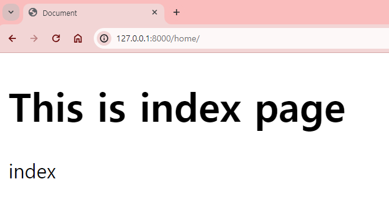
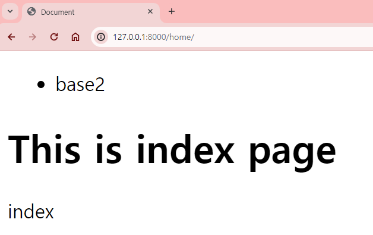

# Template 상속(inheritance)

## 기본 템플릿(Template) 필요성
**html 문서에서 공통적으로 사용되는 부분을 기본 틀 html 문서로 작성하기**
- 더 효율적으로 html 문서를 관리 가능 
- 이후 각 App의 html 문서에서 기본 틀 html 문서를 불러와(정확히는 상속받아) 이외의 부분만 추가 작성해주면 된다.
- 공통적으로 사용되는 부분을 수정할 때 기본틀로 정의한 html 문서만 수정하면 된다.
  - 각 App의 html 문서에서 공통된 부분을 작성하면 추후 수정이 필요할 때 일일히 수정해야 하기 때문에 비효율적이다.

**기본 틀로 사용할 html 문서**를 생성하고 이를 **기본 템플릿으로 사용하는 법을 알아보자.

## 1. 기본틀로 사용할 Template 파일 생성
### 1. 프로젝트 폴더 내 `templates` 하위 폴더 생성
`01_basic.md`에서 생성했던 프로젝트 폴더(`00_INTRO`) 에서 `templates` 하위 폴더를 생성
- 프로젝트에서 생성한 APP의 기본 템플릿을 만들기 위해서, 특정한 APP 폴더 내부가 아닌 프로젝트 폴더에서 `templates` 폴더를 생성했다.
- 장고에서는 `templates` 폴더 내부에 있는 html 문서를 조회하기 때문에,  `templates` 폴더 내부에 html 문서를 생성한다.

> Django에서 Template(html 문서)을 자동 탐색하는 과정
>   1. 마스터 폴더 내 `settings.py` 에서 `INSTALLED_APPS`에 등록된 APP의 순서대로
>   2. APP 내부에 있는 `templates` 폴더 내 해당하는 Template(html 문서)을 탐색

### 2. `base.html` 생성
프로젝트 폴더(`00_INTRO`)의 `templates` 하위 폴더에서 기본 템플릿으로 사용할 `base.html` 문서를 생성한다.
-  `base`라는 html 문서명은 임의로 정한 것이기 때문에 다른 이름으로 설정해도 괜찮다. 
```html
<!DOCTYPE html>
<html lang="en">
<head>
    <meta charset="UTF-8">
    <meta name="viewport" content="width=device-width, initial-scale=1.0">
    <title>Document</title>
</head>
<body>

</body>
</html>
```
- 위 코드는 html 문서로서 브라우저에 보여지기 위해 기본적인 세팅만 되어 있고, `body` 태그 안에 아무 코드도 작성하지 않았기 때문에 빈 페이지로 나올 것이다.

### 3.  `base.html`에서 `block` 활용해 빈 block 생성
1. 기본 템플릿인 `base.html`에서 `block` 태그를 활용해 빈 block을 만들어준다. 
    - ```html
      
      
      ``` 
    - 자식 템플릿이 기본 템플릿을 상속받아 `body` 부분만 작성하면 되도록, 기본 템플릿의 `body`에 `block`태그를 작성한다.
    - 자식 템플릿 은 기본 템플릿을 상속받은 App 내부에서 생성한 template(html 문서)이다.

3. `block` 태그의 이름(name)으로 `content`라고 적어준다.  
    -  ```html
       
       ```
    - 여러 `block` 태그를 사용할 때 `block`의 이름으로 해당 `block`을 찾아갈 수 있게 하는 역할이다.
    - 따라서 하나의 template 에서 중복된 `block`태그의 이름은 사용할 수 없다.
```html
<!DOCTYPE html>
<html lang="en">
<head>
    <meta charset="UTF-8">
    <meta name="viewport" content="width=device-width, initial-scale=1.0">
    <title>Document</title>
</head>
<body>
    

    
</body>
</html>
```
자식 템플릿은 `block` 태그 사이에 코드를 작성해 기본 템플릿의 빈 block을 채울 수 있다.

## 2. `settings.py`에서 `TEMPLATES`에 기본 템플릿 등록
`base.html`을 기본 템플릿으로 사용하기 위해서, 마스터 폴더의 `setting.py`에서 기본 템플릿의 경로를 등록해야 한다.

아래 `settings.py`의 `TEMPLATES`는 기본 템플릿 경로가 설정되있지 않은 상태이다.
```python
TEMPLATES = [
    {
        'BACKEND': 'django.template.backends.django.DjangoTemplates',
        'DIRS': [],
        'APP_DIRS': True,
        'OPTIONS': {
            'context_processors': [
                'django.template.context_processors.debug',
                'django.template.context_processors.request',
                'django.contrib.auth.context_processors.auth',
                'django.contrib.messages.context_processors.messages',
            ],
        },
    },
]
```
### `'DIRS'`의 리스트에 기본 템플릿 경로 등록
```python
TEMPLATES = [
    {
        'BACKEND': 'django.template.backends.django.DjangoTemplates',
        'DIRS': [BASE_DIR / 'templates'],
        'APP_DIRS': True,
        'OPTIONS': {
            'context_processors': [
                'django.template.context_processors.debug',
                'django.template.context_processors.request',
                'django.contrib.auth.context_processors.auth',
                'django.contrib.messages.context_processors.messages',
            ],
        },
    },
]
```
`'DIRS'`의 리스트에 `[BASE_DIR / 'templates'],`라고 기본 템플릿에 대한 경로를 등록해준다.
  1. `BASE_DIR`은 프로젝트 파일(`01_INTRO`)을 의미한다.
  2. 기본 템플릿으로 사용할 `base.html`을 프로젝트 파일의 하위폴더 `templates`에 생성했기 때문에 `[BASE_DIR / 'templates']`로 기본 템플릿 경로를 등록한다.
  3. 컴파일링 콤마 `,`를 잊지않고 작성한다.

`settings.py`에서 기본 템플릿을 찾을 경로를 등록해주었으니, 이제 기본 템플릿을 상속받을 자식 템플릿이 기본템플릿을 찾을 때 프로젝트 파일(`BASE_DIR`)의 `templates`폴더 내부에 있는 html 문서를 탐색하게 된다.

## 3.  Template 상속
기본 템플릿 경로를 등록했기 때문에 Local App에서 생성한 html 문서는 기본 템플릿을 상속받는 자식 템플릿으로 활용할 수 있다.

`01_django_basic.md`에서 생성한 `home` App 폴더의 하위 폴더인 `templates`에 생성한 `index.html`이 `base.html`을 상속받은 자식 템플릿이 되도록 수정해보자.

현재 `index.html`은 아래와 같이 작성되어 있다.
```html
<!DOCTYPE html>
<html lang="en">
<head>
    <meta charset="UTF-8">
    <meta name="viewport" content="width=device-width, initial-scale=1.0">
    <title>Document</title>
</head>
<body>
    <h1>This is index page</h1>
    <p>index</p>
</body>
</html>
```

`body` 내부에 있는 코드만 기본 템플릿인 `base.html`의 내용과 다르고 다른 부분은 공통적으로 사용하고 있다. 

`extends` 태그를 활용해 기본 템플릿을 상속받아 자식 템플릿으로 만들어주고, `block` 태그를 활용해 추가로 작성할 부분만 빈 block에 넣어주자.

### 1. `extend` 태그로 기본 템플릿 상속받기
`index.html`이 `base.html`을 상속받으려면 `extends` 태그를 활용해야 한다.
```html

```
- `extends`는 DTL(Django Template Language) 태그로 템플릿을 상속받게 해준다.
- ``을 `index.html` 상단에 작성해준다.
  - 우리가 상속받으려는 기본 템플릿은 `base.html`이기 때문에 `<상속받을html파일명>`에 대해 `base`가 들어가야 한다.
  - 장고에서 `extends` 태그로 기본 템플릿을 탐색하게 되는데 `settings.py`에서 `'DIR'`에 등록된 경로에서 `'base.html'` 문서를 탐색하여 가져오게 된다.
  - `extend` 태그가 html **코드라인 최상단에 반드시 위치**해야 한다. 그렇지 않으면 오류가 발생한다.
- 최종적으로 `index.html`이 `base.html`을 상속받기 위해서 아래와 같이 코드가 작성된다.
```html

```

### 2. `block`태그 사이에 추가로 작성하고 싶은 `body` 내용을 작성해준다.
1. `block` 태그의 이름(name)으로 `content`라고 적어준다.
   - 우리가 `base.html`에서 사용하려는 `block`태그의 이름이 `content`이기 때문
2. `block`태그 사이에 추가로 작성하고 싶은 `body` 내용을 작성해준다.
```html


    <h1>This is index page</h1>
    <p>index</p>

```
1. `block`태그 사이에 작성해준 코드는 `base.html`에서 `block`태그로 만들어둔 빈 block에 채워진다. 따라서 위에서 작성한 html은 서버 실행시 브라우저에서 아래와 같은 html로 렌더링된다.
```html
<!DOCTYPE html>
<html lang="en">
<head>
    <meta charset="UTF-8">
    <meta name="viewport" content="width=device-width, initial-scale=1.0">
    <title>Document</title>
</head>
<body>
    
    <h1>This is index page</h1>
    <p>index</p>
    
</body>
</html>
```
## 4. 서버 실행 후 `home/` URL 입력 후 확인
서버를 실행한 상태에서 브라우저 주소에 `http://127.0.0.1:8000/home/`를 입력하면 아래와 같이 `index.html`이 랜더되는 것을 확인할 수 있다.

`index.html`이 기본 템플릿 `base.html`을 정상적으로 상속받아 빈 block에 대해 내용이 채워진 것을 확인할 수 있다.



## 5. 여러 가지 기본 템플릿 생성
현재는 `base.html`을 기본 템플릿으로 사용했다. 하지만 프로젝트 파일 내부 `templates` 폴더에 다른 html 문서들을 생성하여 기본 템플릿으로 사용할 수 있다. 기본 템플릿은 프로젝트 파일 내부 `templates` 내부의 html을 탐색하기 때문에 해당 경로 내의 html 문서들은 모두 기본 템플릿으로 사용할 수 있기 때문이다.

예를 들어 프로젝트 파일 내부 `templates` 폴더에 `base2.html`을 아래와 같이 생성했다. 
- `body`에 `nav`태그로 unordered list의 list인 `base2`를 추가로 작성했다.
```html
<!DOCTYPE html>
<html lang="en">
<head>
    <meta charset="UTF-8">
    <meta name="viewport" content="width=device-width, initial-scale=1.0">
    <title>Document</title>
</head>
<body>
    <nav>
        <ul>
            <li>base2</li>
        </ul>
    </nav>
    
    
</body>
</html>
```
`home` App의 `index.html`에서 `extend`태그에서 사용할 기본 템플릿으로 `base2.html`을 설정하려면 아래와 같이 작성하면 된다.
```html


    <h1>This is index page</h1>
    <p>index</p>

```
서버에서 `http://127.0.0.1:8000/home/`를 입력하면 아래와 같이 `base2.html`을 상속받은 `index.html`이 랜더되는 것을 확인할 수 있다.
