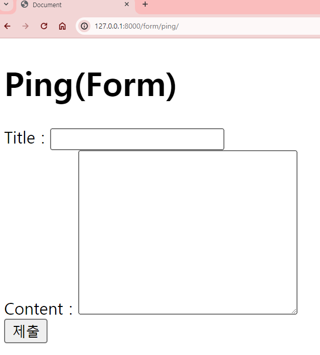
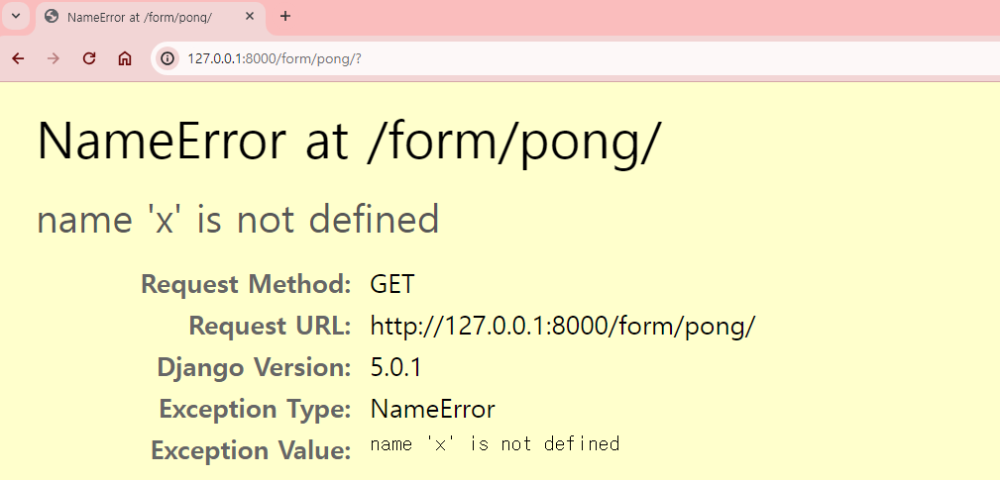
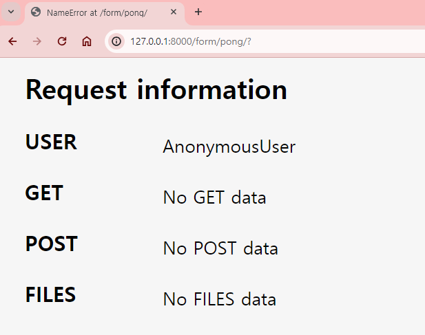
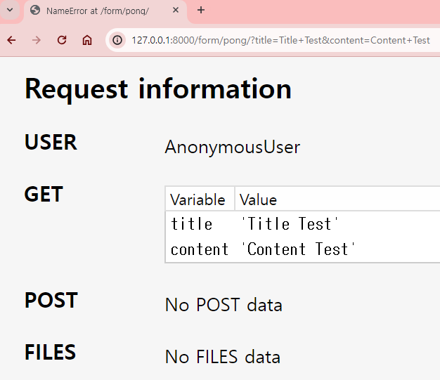

# Form을 이용한 사용자 입력 데이터 활용하기
아래와 같이 요청과 응답이 가도록 Local App `form`을 생성해 설계하도록 하겠다.
1. 클라이언트 컴퓨터에서 `http://127.0.0.1:8000/form/ping/` URL로 서버 컴퓨터에 요청(request)을 하면
2. 서버컴퓨터에서 `ping` 함수가 실행하면서 `ping.html`이 렌더링되도록 응답(response)한다.
3. 클라이언트 컴퓨터에서 응답을 받은 `ping.html` 에는 사용자가 데이터를 입력할 수 있는 Form에 대한 html 문서이다.
4. 사용자가 Form에 대한 입력값을 입력한 후 제출버튼을 누르면 
5. 다시 서버 컴퓨터에 입력한 데이터에 대한 응답으로 `pong` 함수가 실행된다. `pong` 함수는 사용자가 입력한 데이터가 담긴 `pong.html` 가 렌더링 된다.

## 1. Local App `form` 생성 및 등록
### 1. `form` 생성
`00_INTRO` 프로젝트에 새로운 Local App `form`을 생성한다.
```bash
$ python manage.py startapp form
```

### 2. `intro.settings`에 `form` App에 등록
`00_INTRO` 프로젝트의 마스터(관리) 폴더인 `intro`의 `settings.py`에 새로 생성한 `form` App을 등록한다. `INSTALLED_APPS`의 리스트에 `'form'`을 넣고 트레일링 콤마(`,`)도 잊지않고 작성한다.
```python
INSTALLED_APPS = [
    'django.contrib.admin',
    'django.contrib.auth',
    'django.contrib.contenttypes',
    'django.contrib.sessions',
    'django.contrib.messages',
    'django.contrib.staticfiles',
    'home',
    'form',
]
```

### 3. `form` App 폴더 내 필요한 파일/폴더 생성
1. `form` App 폴더 내 URLConf를 담당할 `urls.py` 생성
2.  `form` App 폴더 내 템플릿을 담당할 `templates` 폴더와 하위 폴더인 `form` 생성
    - `templates`의 하위 폴더 `form`은 장고에서 템플릿을 탐색할 때 html 문서명이 다른 App의 html 문서명과 같더라도 경로로서 원하는 html 문서를 탐색할 수 있게 생성한다. 
3. `form/templates/form/` 경로에 설계에 필요한 html 문서인 `ping.html`와 `pong.html`을 생성한다.

## 2. URL 설정
### 1. `intro.urls`에서 `form/` URL 경로에 대해 설정
프로젝트의 마스터(관리) 폴더인 `intro` 내부의 `urls.py`에서 `form/`에 대한 URL 설정을 한다.
`http://localhost:8000/form/` URL 요청시 `form.ulrs`로 포워딩하도록 설정했다.
```python
from django.contrib import admin
from django.urls import path
from django.urls import include

urlpatterns = [
    path('admin/', admin.site.urls),
    path('home/', include('home.urls')),
    path('form/', include('form.urls')),
]
```

### 2. `form.urls`에서 URL 경로 설정
```python
from django.urls import path
from . import views

app_name = 'form'

urlpatterns = [
    path('ping/', views.ping, name='ping'),
    path('pong/', views.pong, name='pong'),
]
```
1. `from django.urls import path` : `urlpatterns`에서 `path()` 함수를 실행할 수 있도록 불러온다.
2. `from . import views` : 현재 경로에 있는 `form.views`를 모듈로서 불러와 `views.py` 내부에 정의한 함수를 실행할 수 있게 한다.
3. `app_name = 'form'` : `form` App의 네임스페이스(namespace)를 지정했다. 추후 다른 문서에서 URL 경로를 작성할 때, URL 하드코딩을 하지 않고 매핑된 네임스페이스로 탐색하도록 설정해준다.
4. `urlpatterns`에 `http://localhost:8000/form/` URL 요청시 포워딩 받을 URL `route`(경로)와 실행될 함수, 그리고 URL 별칭을 작성한다.
   1. `path()`의 첫 번째 인자 `route` : `'ping/'`은 `http://localhost:8000/form/`을 포워딩 받은 후의 URL 경로로 `http://localhost:8000/form/ping/` URL 경로를 작성한 것이다.
   2. `path()`의 두 번째 인자 `fucntion` : `views.ping`은 `route` 인자에 설정한 URL 경로 요청시 실행될 함수에 대한 부분이다. 불러온 `form.views`에서 정의한 `ping` 함수를 실행하기 위해 작성했다.
   3. `name='ping'` : `route`인자 에대한 URL 경로에 대해 URL 별칭으로 `'ping'`을 매핑했다. 추후 다른 문서에서 URL 경로를 작성할 때, URL 하드코딩을 하지 않고 매핑된 URL 별칭으로 탐색하도록 설정해준다.
   4. `path()`에 대한 내용을 작성한 후 트레일링 콤마(`,`)를 잊지 않고 작성한다.
   5. `'pong/'`에 대한 내용도 1 ~ 4의 내용을 따른다.

## 3. `form.views`에서 함수 정의
`form` App 폴더 내 `views.py`에서 `ping`, `pong` 함수를 정의한다.
```python
from django.shortcuts import render

def ping(request):
    return render(request, 'form/ping.html')

def pong(request):
    return render(request, 'form/pong.html')
```

 `ping` 함수가 실행하면서 `ping.html`이 렌더링되고, `pong` 함수가 실행하면서 `pong.html`이 렌더링되고 정의해주었다.

## 4. `ping.html` 작성
`ping.html` 에는 사용자가 데이터를 입력할 수 있는 Form에 대한 html 문서이다.

### 1. 기본 템플릿 상속
`03_template_inheritance.md`에서 `00_INTRO` 프로젝트 파일의 하위폴더 `templates`에 생성한 `base.html`을 기본 템플릿으로 상속받게 한다. 아래는 `base.html`에 대한 코드이다.
```html
<!DOCTYPE html>
<html lang="en">
<head>
    <meta charset="UTF-8">
    <meta name="viewport" content="width=device-width, initial-scale=1.0">
    <title>Document</title>
</head>
<body>
    
    
</body>
</html>
```

`form/templates/form/` 경로의 `ping.html`을 `extend`와 `block` DTL 태그를 활용해 상속받고 작성할 부분에 대한 block을 만들어 준다. `block` 태그에 사용자가 입력할 수 있는 Form을 만들어 줄 것이다.
```html





```
### 2. `ping.html`에 `form` 태그로 form 형성
```html



<h1>Ping(Form)</h1>
<form action="" method="GET">

</form>

```
1. `<h1>Ping(Form)</h1>` : `h1` 태그로 Form의 제목을 만들어 주었다.
2. `form` 태그로 `<form action=""></form>` 사이에 들어갈 내용들이 form인 것을 정해주었다.
3. `form` 태그의 `action` 속성은 해당 form이 제출되었을 때 form을 어디로 보낼지, 즉 요청될 URL 경로를 적어줘야 한다. form 제출시 `pong` 함수가 실행되도록 설계했기 때문에, URL 경로에 `url` DTL 태그를 사용해 `""`를 작성해준다. 여기서 `"form:pong"`은 `form.urls`에서 매핑해둔 `"<URL네임스페이스>:<URL별칭>"`이다. form 제출 시 `'pong'`이라는 URL 별칭을 매핑한 `http://localhost:8000/form/pong/` URL이 요청되어 `pong`함수를 실행된다.
4. `form` 태그의 `method` 속성은 `action` 속성의 URL 경로로 URL이 전달될 때 어떤 방법으로 전달할지를 묻는다. `GET`과 `POST` 두 가지로 설정할 수 있는데, `method` 속성은 기본값이 `method="GET"`으로 되어있다. `method` 속성이 생략되어 있으면 자동으로 기본값으로 설정되어 있는 것이다.
   - 최종적으로 URL 경로의 설정된 함수(`pong`)의 인자 `request`의 `GET`에 form을 전달한다.

### 3. `ping.html`에 `form` 태그 내부 입력창 작성
form 내부에 입력할 수 있는 창을 Title과 Content로 설정하고, 제출버튼까지 작성한다. 편의상 각 입력창에 대해 `div` 태그로 구역을 나누었다.
```html



<h1>Ping(Form)</h1>
<form action="" method="GET">

    <div>
        <label for="title">Title : </label>
        <input type="text" id="title">
    </div>

    <div>
        <label for="content">Content : </label>
        <textarea name="" id="content" cols="30" rows="10"></textarea>
    </div>

    <div>
        <input type="submit">
    </div>

</form>

```
1. `<input type="text" id="title">` : Title에 대한 입력을 받을 수 있게 `input` 태그로 입력창을 생성한다. `id` 속성은 `label` 태그를 사용할 경우 `label`태그가 해당 `id`를 찾아갈 수 있는 경로로서 매핑하는 것이다.
2. `<label for="title">Title : </label>` : Title에 대한 `input` 태그 위에 `label`태그를 작성한다. 
   - Title에 대한 `input` 태그에 대해 `id="title"`를 찾아갈 수 있게 때문에, `<label for="title">`로 `label` 태그와 Title `input` 태그를 연결한다.
   - `label` 태그 사이에 들어간 `Title : `은 `label`과 연결된 `input` 태그에 대한 label로 들어갈 내용이다.
3. `<textarea name="" id="content" cols="30" rows="10"></textarea>` : Content에 대한 입력을 받을 수 있게 `textarea` 태그로 입력창을 생성한다. `id` 속성은 `label` 태그를 사용할 경우 `label`태그가 해당 `id`를 찾아갈 수 있는 경로로서 매핑하는 것이다.
4. `<label for="content">Content : </label>` : : Content에 대한 `textarea` 태그 위에 `label`태그를 작성한다. 
   - Content에 대한 `textarea` 태그에 대해 `id="content"`를 찾아갈 수 있게 때문에, `<label for="content">`로 `label` 태그와 Content의 `textarea` 태그를 연결한다.
   - `label` 태그 사이에 들어간 `Content : `은 `label`과 연결된 `textarea` 태그에 대한 label로 들어갈 내용이다.
5. `<input type="submit">`: Title `input` 태그와 Content `textarea` 태그에 대한 입력창에 사용자가 입력값을 입력하고 제출할 수 있도록 제출버튼을 생성한다. `input`태그를 생성하고 `type` 속성에 `"submit"`을 넣어주면 제출버튼이 된다.

## 5. 서버 실행후 브라우저에서 확인
서버를 실행한 후 브라우저에서 `http://localhost:8000/form/ping/` URL을 요청하면 `form.views`의 `ping` 함수가 실행되면서 `ping.html`이 렌더링된다. 아래 이미지처럼 `ping.html`에 작성된 제목과 Form이 나오는 것을 확인할 수 있다.



그렇다면 `ping.html`에 입력한 데이터가 pong에 제대로 전달되는 지 확인해보자. Title 입력창에 'Title Test'를 입력하고 Content 텍스트에리어 입력창에 'Content Test'라고 입력한 후 제출버튼을 눌러보겠다.


`<form action="" method="GET">`에 설정한 경로대로 URL이 이동하여 `pong` 함수가 실행되어 `pong.html`이 렌더링되었다. 하지만 이 상태에서는 입력한 데이터가 pong에 전달되었는지 확인할 수 없다. 일부러 `pong` 함수의 정의에 오류를 넣어서 디버그 페이지를 받아보겠다.

### `home.views`의 `pong` 함수에 오류 넣기
`pong` 함수에서 인자로 받지않은 `x`라는 변수에 대해 처리하지 못하기 때문에 오류가 발생하여, `pong `함수 실행시 디버그 페이지가 렌더링된다.
```python
def pong(request):
    x
    return render(request, 'form/pong.html')
```

위와 같이 수정 후 다시 서버에서  `http://localhost:8000/form/ping/` 에서 입력값을 제출한 후 어떻게 페이지가 뜨는지 확인해보자.



위 이미지처럼 `x`라는 변수에 대한 내용을 찾을 수 없어서 디버그 페이지가 렌더링 된다. 페이지의 아래로 가면 우리가 전달한 입력값이 정상적으로 `pong` 함수의 인자 `request`의 `GET`에 전달되었는지 확인해보자.



Request information 을 확인해보면 `pong` 함수의 인자 `request`에 어떤 데이터가 전달되어있는지 확인할 수 있다. `GET`에 전달된 데이터가 없다는 것을 확인할 수 있다. 어떤 부분을 작성하지 않아서 발생한 오류인지 찾아보자.

## 6. `ping.html` 오류 수정
입력을 위한 태그에 대해 `name` 속성을 정하지 않아서 발생한 오류이다. `name` 속성은 서버에서 `pong` 함수의 `request`로 전달한 form의 입력 데이터에 대한 변수명을 지정해주는 것이다. 딕셔너리의 데이터 형태를 가지기 때문에 현재 딕셔너리의 key에 들어갈 `name` 속성이 정의되어 있지 않고, value에 들어갈 입력 데이터만 전달되기 때문에 정상적으로 데이터가 전달되지 않는 것이다.
```html



<h1>Ping(Form)</h1>
<form action="" method="GET">

    <div>
        <label for="title">Title : </label>
        <input type="text" id="title" name="title">
    </div>

    <div>
        <label for="content">Content : </label>
        <textarea name="content" id="content" cols="30" rows="10"></textarea>
    </div>

    <div>
        <input type="submit">
    </div>

</form>

```
1. Title에 대한 `input` 태그의 `name` 속성에 `name="title"`을 작성한다. `title`이라는 변수명은 임의로 정한 것이기 때문에 변경가능하다. 하지만 일관된 규칙으로 변수명을 만들어주는 것이 좋기 때문에, `id`와 같은 변수명으로 만들었다.
2. 1번과 같은 이유로 Content에 대한 `textarea` 태그의 `name` 속성에 `name="content"`를 작성한다.

참고로 `input` 혹은 `textarea` 태그의 `id` 속성은 html과 CSS 문서 내부에서 id에 대한 경로를 찾을 때 사용되고, `name` 속성은 서버의 특정 함수의 인자 `request`로 전달할 때 사용한다. 
- 현재 `id`와 `name` 속성에 변수명을 같게 작성했지만, 서로 다른 역할을 하고 있다는 것을 기억하자.

## 7. 입력한 데이터가 전달되었는지 확인하기
다시 한번 `http://localhost:8000/form/ping/` 에서 Title 입력창에 'Title Test'를 입력하고 Content 텍스트에리어 입력창에 'Content Test'라고 입력한 후 제출버튼을 눌러보겠다.

제출버튼을 누르면 `form` 태그의 `action`에 해당하는 URL(`http://localhost:8000/form/pong/`)이 요청되어 `pong`함수가 실행된다. 현재 `pong` 함수에는 일부러 오류를 넣어두었기 때문에 디버그 페이지가 나타난다.
디버그 페이지의 하단에 Request information 을 확인해보면 `pong` 함수의 인자 `request`의 `GET`에 입력한 데이터가 정상적으로 전달된 것을 확인할 수 있다.



`GET` 에 딕셔너리 형태로 key에는 각각 `name`으로 설정한 `title`, `content`가 들어가고 values에는 각 입력창에 해당하는 입력값 `Title Test`, `Content Test`가 들어가 있는 것을 확인할 수 있다.

참고로 URL을 확인해보면 URL이 GET에 전달된 key와 value로 이루어진 것을 확인할 수 있다. 이는 `form`태그의 `method` 속성으로 `GET`으로 설정해서 그렇다. key로 설정한 입력창에 대한 변수명과 입력한 데이터에 대해 누구나 확인할 수 있다. 따라서 보안적으로 공개해도 되는 데이터에 대해서만 `GET`으로 설정해야 한다. 만약 데이터에 대한 보안이 필요할 경우 `POST`로 설정해야 하는데 이는 추후에 자세히 다룰 예정이다.

## 8. `form.views`의 `pong` 함수 수정
`pong` 함수가 실행되면 `ping.html`에서 사용자가 입력한 데이터가 담긴 `pong.html` 가 렌더링되도록 설정해야 한다.

7번에서 확인한 `pong`함수의 인자 `request`의 `GET`에 딕셔너리로 담긴 데이터를 이용해 변수를 설정하고 context로 넘겨 `pong.html`에 DTL로 변수를 보여주도록 해야 한다.

### 1. `title = request.GET['title']`
```python
def pong(request):
    title = request.GET['title']
    return render(request, 'form/pong.html')
```
1. `request.GET['title']`으로 사용자 입력 데이터를 받을 수 있다.
   - `request.GET`은 딕셔너리 형태의 객체이다. 
   - `request.GET`의 key에는 `ping.html`의 Title 관련 `input` 태그의 `name` 속성으로 정한 변수명 `'title'`이 전달된다.
   - `request.GET`의 value에는 `ping.html`의 Title 관련 입력창에 사용자가 입력한 데이터가 전달된다.
   - `request.GET['title']`은 `request.GET` 딕셔너리 객체의 key가 `'title'`인 value, 즉 Title 입력창에 사용자가 입력한 데이터를 의미한다.
2. `title = request.GET['title']` : Title 입력창에 사용자가 입력한 데이터인 `request.GET['title']`를 `title`이라는 변수에 할당했다.

### 2. `content = request.GET['content']`
```python
def pong(request):
    title = request.GET['title']
    content = request.GET['content']
    return render(request, 'form/pong.html')
```
1. `request.GET['content']` : title과 마찬가지로 `request.GET` 딕셔너리 객체의 key가 `'content'`인 value, 즉 Content 입력창에 사용자가 입력한 데이터를 의미한다.
2. `title = request.GET['title']` : Contetn 입력창에 사용자가 입력한 데이터인 `request.GET['content']`를 `content`라는 변수에 할당했다.

### 3. 변수 `title`과 `content`를 context 넘기기
```python
def pong(request):
    title = request.GET['title']
    content = request.GET['content']
    return render(request, 'form/pong.html', 
                  {'title':title, 'content':content, })
```
변수 `title`과 `content`를 `pong.html`에서 변수로 사용할 수 있게 context에 넘겨준다.

## 9. `pong.html`에 입력받은 데이터 연결
```html



<h1>{{ title }}</h1>
<h2>{{ content }}</h2>

```
1. `extend`와 `block` DTL 태그를 이용해 기본 템플릿을 상속받는다.
2. `pong` 함수에서 context로 넘긴 변수 `title`과 `content`를 DTL을 이용해 변수로서 사용해준다.
   - 각각 `h1`, `h2` 태그를 활용해 제목에 Title에 사용자가 입력한 값이 나오고, 부제목에 Content에 사용자가 입력한 값이 나오도록 작성했다.


## 10. 서버 실행후 브라우저에서 확인
1. `'http://localhost:8000/form/ping/'`URL에서 나오는 Form에 아래 이미지처럼 입력값을 작성하고 제출버튼을 누른다.
    - 
2. form aciton에 대한 경로로 'http://localhost:8000/form/pong/' URL이 요청되어 `pong` 함수가 실행되어 `pong.html`이 렌더링되어 응답한다.
    - 
    - 1에서 입력한 데이터가 정상적으로 pong.html에 들어가 렌더링되는 것을 확인할 수 있다.
