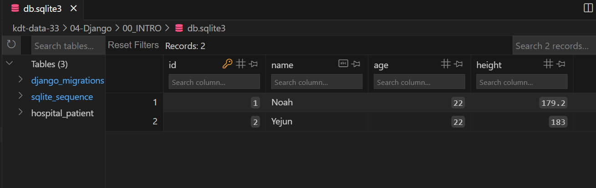

# Model

## 데이터베이스(DataBase)의 필요성
`05_form.md`에서 사용자가 입력한 데이터를 특정 함수의 인자 `request`로 전달 받아 변수로서 html에 사용해보았다. 하지만 사용자가 입력한 데이터는 일시적으로 저장될 뿐, 다음 입력값이 제출되면 이전 데이터를 찾을 수 없다. 

**입력받은 데이터를 영구적으로 저장**하기 위해서는 데이터를 **데이터베이스(DB)에 저장**해야 한다.

## Model
장고는 MTV 디자인 패턴을 따른다고 이전에 설명했다. MTV(Model Template View)에서 데이터베이스와 관련된 것이 Model이다.


모델은 데이터를 저장하는 데이터베이스(DB)를 관리한다. 모델은 class로 정의되며 하나의 class가 하나의 DB Table이다. 

### ORM(Object Relational Mapping)
장고에서는 파이썬 언어를 사용하고, DB에서는 SQL 언어를 사용하기 때문에 장고와 DB가 통신하는 것은 원칙적으로 불가능하다. 하지만 **ORM**이 파이썬과 SQL의 중간다리 역할을 해준다. 
- ORM은 **객체(Python)와 관계(RDBMS-SQL)를 매핑(대응)해주는 작업**을 한다. 
- ORM으로 장고 Model에서 파이썬 코드로 DB를 조작할 수 있다.
- ORM의 역할을 하는 것은 다양하다. 대표적으로 파이썬에서는 `SQLalchemy` 가 있다. 하지만, 장고에서는 장고에 내장되어 있는 `Django ORM`만 사용해도 충분하다.

## `hospital` App의 Model  
### 1. Local App `hospital` 생성 및 등록
1. `00_INTRO` 프로젝트 폴더에 Local App `hospital` 생성한다. `hospital` App의 `models.py`에서 클래스를 생성하여 DB의 Table과 어떻게 연결되는지 확인할 것이다.
```bash
$ python manage.py startapp hospital
```

2. `intro.settings`에서 `INSTALLED_APPS`에 `hospital` App을 등록한다.
```python
INSTALLED_APPS = [
    'django.contrib.admin',
    'django.contrib.auth',
    'django.contrib.contenttypes',
    'django.contrib.sessions',
    'django.contrib.messages',
    'django.contrib.staticfiles',
    'home',
    'form',
    'hospital',
]
```
---

### 2. `hospital.models`에서 `Patient` 모델(클래스) 정의
`hospital` App 폴더 내의 `models.py`에서 `00_INTRO` 프로젝트의 DB와 연결될 클래스를 정의할 것이다. `models.py`에 정의하는 클래스는 해당 프로젝트의 `db.sqlite3`, DB인 SQL의 Table과 연결되는 모델이다. 정의한 클래스를 모델이라고 하기 때문에 이제부터 `modles.py`에서 정의한 클래스를 모델이라고 지칭 하겠다.

`Patient` 모델을 정의한다.
```python
from django.db import models

class Patient(models.Model):
    pass
```
- `Patient`라는 모델명은 임의로 정한 것이기 때문에 다른 것으로 작성해도 괜찮다. 모델명은 DB에 이동할 때 `APP이름_클래스이름` 형태의 테이블명으로 생성된다.
- `class Patient(models.Model):` :  `Patient` 모델(클래스)가 `models`의 `Model` 모델(클래스)을 상속받는다는 의미이다.

---

### 3. `Patient` 모델의 필드 정의
클래스 속성(클래스 변수)는 해당 모델의 필드(fields)를 의미한다. 필드는 DB의 컬럼(column)과 매핑된다.
  - clean, save, delete 같은 model API 단어들은 필드명으로 사용할 경우 원래 기능이 충돌될 수 있기 때문에 사용하지 않도록 주의한다.

모델의 각 필드는 적당한 `Field` 클래스의 인스턴스여야 한다. 장고에서 아래 사항들을 결정하는데 `Field` 클래스 타입을 사용한다.
  - DB의 스키마(Schema)를 알려주는 컬럼 타입
    - 스키마 : DB에 데이터가 저장되는 방식
    - ex. `INTEGER`, `VARCHAR`, `TEXT`
  - Form 필드를 렌더링할 때 사용하는 기본적인 HTML 위젯(widget)
    - ex. `<input type="text">`
  - 장고의 `admin`과 자동적으로 생성되어있는 Form을 사용할 때 필요한 최소한의 유효성 검사

즉, 각각의 필드에 넣을 데이터의 종류에 따라 문자열, 정수, 실수, 시간 등의 데이터 형태를 `Field` 타입으로 정해주는 것이다.

`Patient` 모델의 필드로 `name`, `age`, `height`을 생성하고 필요한 필드 타입을 할당해주었다.
```python
from django.db import models

class Patient(models.Model):
    name = models.CharField(max_length=30)
    age = models.IntegerField()
    height = models.FloatField()
```
- `models.CharField(max_length=30)` : `models`의 클래스 `CharField`를 사용하여 문자열 타입의 데이터만 입력받을 수 있도록 데이터 타입 지정
  - 반드시 `max_length` 옵션을 지정해줘야 한다. `max_length`는 문자열 데이터에 대해 입력받을 수 있는 최대 길이이다. 문자열 데이터가 입력받을 수 있는 최대길이를 30으로 지정해주었다.
- `models.IntegerField()` : `models`의 클래스 `IntegerField`를 사용하여 정수 타입의 데이터만 입력받을 수 있도록 데이터 타입을 지정
- `models.FloatField()` : `models`의 클래스 `FloatField`를 사용하여 실수 타입의 데이터만 입력받을 수 있도록 데이터 타입을 지정
- 이 외에도 `EmailField`, `URLField`, `TextField`, `BooleanField`, `DatetimeField`, `FileField`, `ImageField` 등 다양한 모델의 필드 타입이 있다.

---

### 4. 서버실행 후 DB 확인
1. 처음으로 `model.py`에 클래스를 정의하고 서버를 실행하면 프로젝트 내부에 DB와 관련된 `db.sqlite3` 파일이 생성된 것을 확인할 수 있다.
  - ```bash
    $ python manage.py runserver
    ```

2. VSCode에서 아래 이미지처럼 `SQLite Viewer` extension을 설치하면 SQL이 보기 편해진다. 선택 사항이다.
  - 


3. `db.sqlite3` 파일에 들어가면 아래 이미지처럼 Table에 아무것도 없다는 것을 확인할 수 있다. 우리가 정의한 클래스 `Patient`를 DB의 Table에 전달해야 한다.
  - 

---

### 5. 마이그레이션(Migration)
Migration은 이주하는 것, 이동하는 것을 의미한다. 

즉, **마이그레이션은 코드(파이썬 언어)로 작성한 클래스를 실제 데이터베이스(DB)에 테이블로 옮기는 과정**이다. 모델을 생성하면 ORM을 통해 Migrations 파일을 생성하고 Migrations 파일이 DB에 적용된다. 

마이그레이션은 두 가지 절차를 통해 진행된다.

#### 1. migrations 생성
1. `Patient` 클래스(모델)를 DB의 테이블 스키마를 생성 혹은 수정하기 위해 터미널에서 `python manage.py makemigrations`과 마이그레이션을 진행할 Local App `hospital`을 작성해준다. 프로젝트 파일 경로에서 코드를 실행해야 한다.
  - ```bash
    $ python manage.py makemigrations hospital
    ```
  -  이 명령이 실행되면 해당하는 장고 App 안에 `migrations` 라는 하위(서브)폴더를 만들고 **테이블 생성 및 수정을 위한 파이썬 Migrations 파일들을 생성한다.**
  - `hospital` App 폴더에 하위폴더 `migrations`에 `0001_initial.py`가 생성되었다. 
  - ```bash
    Migrations for 'hospital':
      hospital\migrations\0001_initial.py
        - Create model Patient
    ```
  - 참고로 `python manage.py makemigrations` 코드만 실행하면 프로젝트 전체에 대해 Migrations를 생성한다.

2. 생성된 `hospital/migrations/0001_initial.py` 파일을 확인하면 아래와 같다.
  - ```python
    # Generated by Django 5.0.1 on 2024-01-14 16:09

    from django.db import migrations, models


    class Migration(migrations.Migration):

        initial = True

        dependencies = [
        ]

        operations = [
            migrations.CreateModel(
                name='Patient',
                fields=[
                    ('id', models.BigAutoField(auto_created=True, primary_key=True, serialize=False, verbose_name='ID')),
                    ('name', models.CharField(max_length=30)),
                    ('age', models.IntegerField()),
                    ('height', models.FloatField()),
                ],
            ),
        ]
    ```
   - 우리가 `hospital.models`에서 정의한  `Patient` 모델을 어떻게 DB에 매핑할지에 대한 내용이 담겨있다. 직접 모델의 필드로 작성한 `name`, `age`, `height` 외에 `id` 필드가 자동적으로 생성된 것을 확인할 수 있다.
   - `id` 필드는 모델과 매핑될 DB에서 데이터가 입력될 때마다 자동으로 생성하는 `primary_key` 필드이다. `pk`는 `id`와 같은 필드명으로 사용된다.

#### 2. migrate
**생성한 Migrations를 DB에** 테이블을 생성하거나 수정하기 위해 **실제로 적용**하는 아래 명령어를 터미널에 실행한다. 프로젝트 파일 경로에서 실행해야 한다.
  - ```bash
    $ python manage.py migrate hospital
    ```
  - 터미널에서 코드를 실행하면 아래와 같이 응답받는다. 
  - ```bash
    Operations to perform:
      Apply all migrations: hospital
    Running migrations:
      Applying hospital.0001_initial... OK
    ```

#### 3. DB 테이블 생성 및 수정 확인
`db.sqlite3` 파일을 새로고침하면 DB에 `hospital_patient` 테이블이 생성된 것을 확인할 수 있다. 테이블 컬럼에 Primary key인 `id` 필드와 `name`, `age`, `height`가 컬럼명으로 들어가 있는 것을 확인할 수 있다.
  - 
  - `hospital` App의 `models.py`에 정의한 `Patient` 모델이 DB에 테이블로 마이그레이션한 것이다.

모델의 수정, 서버나 구조의 변경 등으로 DB 구조의 수정이될 경우 매번 마이그레이션을 하는 두 가지 명령어를 적용하여 에러가 나지 않게 주의한다.

## `django_extensions` 설치
터미널에서 아래 코드를 입력해 `django_extensions` 설치해준다. 해당 프로젝트 경로에서 실행한다.
```bash
$ pip install django_extensions
```
- `django_extensions`는 장고에서 공식적으로 만든 App이 아니라 다른 팀에서 장고 라이브러리로 만든 것이다. 
- `django_extensions`를 설치하면 `shell_plus` 기능을 사용할 수 있다.
- 이렇게 3rd Party Apps로 설치한 외부 라이브러리 App은 프로젝트의 마스터(관리) 폴더의 `settings.py`의 `INSTALLED_APPS`에 등록해줘야 한다.

```python
INSTALLED_APPS = [
    # 장고 기본 Apps
    'django.contrib.admin',
    'django.contrib.auth',
    'django.contrib.contenttypes',
    'django.contrib.sessions',
    'django.contrib.messages',
    'django.contrib.staticfiles',

    # 3rd Party Apps
    'django_extensions',

    # Local Apps
    'home',
    'form',
    'hospital',
]
```
- 기본 설치 APPS, 3rd Party APPS, Local APPS을 구분해서 `INSTALLED_APPS` 리스트에 추가하는 것이 좋다.
    - **3rd Party App**은 `pip`로 설치한 APP, 즉 외부 라이브러리 앱을 의미
    - **Local APP**은 장고에서 `python manage.py startapp`으로 직접 생성한 앱을 의미
  - 3rd Party Apps 설치 후 혹은 Local Apps 생성 후에는 반드시 `settings.py`의 `INSTALLED_APPS`의 리스트에 관련 Apps를 등록해야 작동한다.
  - APP을 추가 작성한 마지막에 **Trailing Commas(`,`)** 를 작성해줘야 한다.

### `shell_plus`
터미널에서 `shell_plus`를 사용하면 기존 `shell`보다 편하게 사용할 수 있다. `hospital.models`의 모델과 연결된 DB 테이블의 데이터 CRUD(생성, 조회, 수정, 삭제) 작업을 할 때 `shell_plus`를 사용할 것이다.

터미널에서 프로젝트 파일(`00_INTRO`) 경로에서 아래 코드를 입력후 실행하면 `shell_plus`를 터미널로 사용할 수 있다.
```bash
$ python manage.py shell_plus
```

 `shell_plus`가 아래처럼 터미널에 나타나는 것을 확인할 수 있다.
 

## DB에서 데이터를 다루는 방법 - `CRUD`
**CRUD**는 DB에서 데이터를 다루는 방법 4가지인, Create(생성), Read(읽기), Update(갱신), Delete(삭제)를 묶어서 일컫는 말이다. CRUD는 DB뿐만 아니라 대부분의 컴퓨터 소프트웨어가 가지는 기본적인 데이터 처리 기능이다.
 - 생성, 수정, 삭제는 DB의 데이터가 바뀐다. 즉, 위험도가 높다.
 - 조회는 DB의 데이터를 탐색하는 것이기 때문에 상대적으로 위험도가 낮다.

|이름|DB의 조작|SQL|설명|
|---|---|---|---|
|Create|생성|INSERT| 새로운 데이터를 추가|
|Read/Retrieve|조회/인출|SELECT| 기존 데이터를 검색|
|Update|수정|UPDATE|기존 데이터를 편집|
|Delete/Destory|삭제/파괴|DELETE|기존 데이터를 삭제|

장고에서는 직접 SQL을 작성하지 않고 Django ORM의 파이썬 메서드를 사용하여 DB를 쿼리(Query)할 수 있다. 다양한 메서드를 사용해 모델의 인스턴스를 CRUD(생성, 조회, 수정, 삭제)할 수 있다.

`shell_plus`을 터미널로 사용해서 DB의 `hospital_table` Table에 데이터를 CRUD를 진행해보자.


## 1.Create(생성) - Table에 하나의 row 생성
`models.py`에서 정의해준 클래스를 활용해 클래스 인스턴스 생성 후, 클래스 인스턴스에서 클래스 변수(필드)에 데이터 값을 각각 할당하여 DB의 테이블에 하나의 row를 생성할 수 있다. 크게 세 가지 방법이 있다.

### 1. Create 생성 방법 (1)
클래스 인스턴스 생성 후, 클래스 인스턴스에서 클래스 변수(필드)에 데이터 값을 각각 할당하여 `save()` 메서드로 저장하면 DB에 할당된 값이 해당 필드의 row 데이터로 생성된다.
```shell
In [1]: p1 = Patient()

In [2]: p1.name = 'Noah'

In [3]: p1.age = 22

In [4]: p1.height = 179.2

In [5]: p1.save()
``` 
   1. `p1 = Patient()` : `Patient` 클래스의 인스턴스 `p1`을 생성한다.
      - `p1`이라는 인스턴스명은 임의로 정한 식별자이다. 
   2. `p1.name` : 클래스 `Patient`의 인스턴스로서 클래스 `Patient`의 클래스 변수(필드) `name` 에 접근한다.
      - 클래스 `Patient`의 클래스 변수(필드) `name`은 DB의 테이블 `hospital_table`의 칼럼 `name`과 연결되어 있다.
      - ` p1.name = 'Noah'` : 클래스 변수(필드) `name`에 `'Noah'`라는 문자열 객체를 할당했다.
      - 문자열 객체를 할당한 이유는 `hospital.model`에서 `name`이라는 클래수 변수에 입력받을 수 있는 데이터의 형태, 즉 필드 타입을 `CharField`로 지정해주었기 때문이다.
        -  `models.CharField(max_length=30)`
   3. 마찬가지로 클래스 변수 `age`, `height`에 접근해 `22`, `179.2`라는 정수, 실수 객체를 할당했다.
   4. `p1.save()` : 각 필드에 값을 할당했다면, 마지막으로 클래스 인스턴스 `p1`에 대해 `save()` 메서드로 저장해야 DB에 실제로 저장된다. 
      - DB에는 NULL, 즉 데이터가 없이 저장할 수 없다. 
      - 만약 문자열 데이터의 경우 값을 할당하지 않아도 빈문자열을 데이터로 넣기 때문에 에러가 발생하지 않지만, 정수나 실수 등의 데이터 타입은 값을 할당하지 않으면 데이터가 없기 때문에 에러가 발생한다.
      - 예를 들어 `name` 필드만 값을 할당하고 `save()`메서드로 저장하면 `age`, `height`에 들어갈 데이터가 없기 때문에 에러가 발생한다.
      
   5. `db.sqlite3` 파일을 새로고침하면 `hospital_patient` 테이블에서 `p1`에 입력한 각 column에 해당하는 row 데이터가 추가된 것을 확인할 수 있다.
   
 

### 2. Create 생성 방법 (2)
클래스에서 클래스 변수에 대한 값을 할당한 채로 클래스 인스턴스를 생성하고 `save()` 메서드로 저장하면 DB에 할당된 값이 해당 칼럼의 row 데이터로 생성된다.
```shell
In [6]: p2 = Patient(name='Yejun', age=22, height=183)

In [7]: p2.save()
```
  1. 클래스 `Patient`의 클래스 변수(필드) `name`, `age`, `height`에 각각 `Yejun`, `22`, `183` 객체를 할당한 상태에서 클래스 인스턴스 `p2`를 생성했다.
  2. `save()` 메서드로 저장하면 DB에서 `p2`에 할당된 각 column에 해당하는 row 데이터가 추가된 것을 확인할 수 있다.

 

### 3. Create 생성 방법 (3)
`save()` 메서드를 사용하지 않고 `create()` 메서드를 활용하여 아래 코드처럼 입력하면 바로 DB에 데이터를 추가할 수 있다.
```shell
In [9]: p3 = Patient.objects.create(name='Eunho', age=20, height=184)
```


## 2. Read(조회) - Table의 특정 row 조회
 `all()` 메서드로 모델의 모든 인스턴스를 검색하거나, `get()` 메서드로 모델의 단일 인스턴스를 가져오거나, `filter()` 메서드로 모델의 인스턴스를 필터링할 수 있다.

### 1. 전체 조회 - `all()` 메서드
```python
<클래스명>.objects.all()
```
`all()` 메서드는 DB 테이블에서 모든 객체를 전달받은 QuerySet를 반환한다.

**QuerySet(쿼리셋)** 은 DB에서 전달받은 객체들의 모음(list)이다. 파이썬으로 작성한 코드가 SQL로 매핑(mapping)되어 QuerySet이라는 자료 형태로 값이 넘어온다. 하위 코드들은 DB에 저장된 모든 객체를 불러온다.

QuerySet(쿼리셋)은 DB에서 데이터를 읽고, 필터를 걸거나 정렬할 수 있다.

클래스 `Patient`에 `all()` 메서드를 적용해보겠다.
```shell
In [10]: patient = Patient.objects.all()

In [11]: patient
Out[11]: <QuerySet [<Patient: Patient object (1)>, <Patient: Patient object (2)>, <Patient: Patient object (3)>]>
```
- `Patient.objects.all()` : 클래스 `Patient`에 대한 DB에서 각 row를 객체로 받아, 모든 객체를 묶은 QuerySet을 반환한다. 이를 `patient`라는 변수에 할당했다.

```shell
In [12]: Patient.objects.values()
Out[12]: <QuerySet [{'id': 1, 'name': 'Noah', 'age': 22, 'height': 179.2}, {'id': 2, 'name': 'Yejun', 'age': 22, 'height': 183.0}, {'id': 3, 'name': 'Eunho', 'age': 20, 'height': 184.0}]>

In [13]: Patient.objects.values('name')
Out[13]: <QuerySet [{'name': 'Noah'}, {'name': 'Yejun'}, {'name': 'Eunho'}]>
```
- QuerySet에 담긴 object에 대해 더 자세히 이해하기 위해 `values()` 메서드를 사용해보자.
- `values()` 메서드는 QuerySet을 딕셔너리 형태로 반환한다. 
- `Patient.objects.values()`를 보면 `Patient`에 대한 테이블의 각 row 데이터들이 딕셔너리 형태로 담겨있는 QuerySet을 확인할 수 있다.
- `values()` 메서드에 인자로 column명을 넣으면 해당 column과 관련된 데이터만 딕셔너리형태로 가져올 수 있다.

```shell
In [10]: patient = Patient.objects.all()

...

In [13]: for p in patient:
    ...:     print(p.name)
    ...: 
Noah
Yejun
Eunho


In [14]: patient_name = []

In [15]: for p in patient:
    ...:     patient_name.append(p.name)
    ...: 

In [16]: patient_name
Out[16]: ['Noah', 'Yejun', 'Eunho']

```
-  QuerySet으로 반환되었어도 실제로 DB에 query가 이루어지지는 않는다. 이것은 QuertSet의 lazy한 특성 때문인데, 실제로 데이터를 가져오려면, 위 코드처럼 for문을 이용해 QuerySet을 순회(iterate)시켜야 한다. 
- `patient`는 리스트 형태인 QuerySet이기 때문에 iterable(순회가능한) 객체임을 알 수 있다. 따라서 for문을 활용해서 전체 데이터에서 특정 조건에 대한 데이터들을 받아 볼 수 있다. 
- `patient_name`과 같이 특정 리스트에 원하는 조건의 데이터를 리스트에 추가할 수도 있다.

### 2. 단일 조회 - `get()` 메서드
```python
<클래스명>.objects.get(조건)
```
`get()` 메서드는 조건에 해당하는 1개의 row를 객체로 반환한다.
- 조건에 해당하는 row가 존재하지 않는 경우, `matching query does not exit` 에러 발생한다.
- 1개의 row만 반환하기 때문에, 해당 조건에 해당하는 데이터가 여러개일 경우 `MultipleObjectReturned` 에러 발생한다.
- 데이터를 조회할 때 `get()` 메서드를 사용할 조건이 되지 않는다면 아래에서 소개할 `filter()` 메서드로 조회하면 된다.

```shell
In [14]: noah_data = Patient.objects.get(name='Noah')

In [15]: noah_data
Out[15]: <Patient: Patient object (1)>

In [16]: print(noah_data.name, noah_data.age, noah_data.height)
Noah 22 179.2
```
1. `Patient.objects.get(name='Noah')` : `Patient` 모델과 연결된 DB의 테이블에서 `name` 컬럼에 `'Noah'`인 조건을 만족하는 1개의 row 데이터를 QuerySet 객체로 받는다.
2. 원하는 조건의 데이터가 담긴 객체를 `noah_data` 변수에 할당했다.
3. `noah_data.name` : `noah_data`에서 `name` 필드를 확인하면  매핑된 DB의 데이터 `Noah`가 반환된다.
4. `noah_data`에서 `age`, `height` 필드에 대해 접근하면 매핑된 DB의 데이터 `22`, `179.2`가 반환된다.

```shell
In [17]: noah_data.id
Out[17]: 1

In [18]: noah_data.pk
Out[18]: 1
```

- noah_data에 해당하는 row에서 `id` 필드에 매핑된 데이터가 `1`인 것을 확인할 수 있다.
- `id` column은 장고에서 자동으로 생성하는 primary key로 각 row 데이터 별로 중복되지 않는다. 따라서 특정 `id` 즉, 특정 `pk`를 활용하는 것이 가장 확실하게 데이터에 조회할 수 있는 방법이다.
  - `pk`는 primary key의 약자이다.
  - `id`로 조회한 데이터와 `pk`로 조회한 데이터는 일치하다. 같은 값을 나타내기 때문이다. 보통 `id`보다 `pk`를 활용해 객체에 조회한다.

### 3. 조건 조회 - `filter()` 메서드
```python
<클래스명>.objects.fiter()
```
`filter()` 메서드는 조건에 해당하는 여러 row를 모두 묶어 QuerySet 형태의 객체로 반환한다.
- `filter()` 메서드의 인자에 조건을 작성해주면 된다.
- 조건에 해당하는 row가 존재하지 않는 경우, 빈 QuerySet을 반환한다.

```shell
In [19]: age_22 = Patient.objects.filter(age=22)

In [20]: age_22
Out[20]: <QuerySet [<Patient: Patient object (1)>, <Patient: Patient object (2)>]>

In [21]: for n in age_22:
    ...:    print(n.name)
    ...:
    ...:
Noah
Yejun
```
- `Patient.objects.filter(age=22)` : `Patinet` 모델의 인스턴스로 `age` 필드값(데이터)이 `22`인 조건을 만족하는 DB 테이블의 row들을 묶은 QuerySet 객체 반환한다. 이를 `age_22`라는 변수에 할당했다
- `age_22`는 list이기 때문에 for문으로 `name` 필드값에 대해 접근할 수 있다.
- for문을 최종적으로 조건(age=22)을 만족하는 `name`에 해당하는 필드값을 조회할 수 있다.

## 3. Update(수정) - Table의 특정 필드 수정
DB에서 `pk(id)`가 `1`인 row의 `age` 컬럼 데이터를 `40`으로 수정하고 싶다면 아래와 같이 코드를 작성한다.
```shell
In [22]: p1 = Patient.objects.get(pk=1)

In [23]: p1.age = 40

In [24]: p1.save()
```
1. `get()` 메서드를 사용해 수정하고 싶은 특정 row의 객체를 반환 
2. 수정하고 싶은 필드에 대해 값을 재할당한다.
3. `save()` 메서드를 사용해 수정된 데이터를 저장해야 DB에 반영된다.
4. DB에서 확인해보면 해당 조건의 컬럼의 데이터가 40으로 수정된 것을 확인할 수 있다.

 

## 4. Delete(삭제) - Table의 특정 row 삭제
```shell

```
1. `get()` 메서드를 사용해 수정하고 싶은 특정 row의 객체를 반환
2. `delete()` 메서드를 활용해 삭제를 실행
  - 저장할 필요없이 바로 삭제가 실행되고, 이는 되돌릴 수 없다.
3. DB에서 확인해보면 해당 조건의 row가 삭제된 것을 확인할 수 있다.

 

삭제 후 새로운 row를 생성하면, `id` 칼럼은 삭제된 row의 `id` 컬럼의 다음 번호가 생긴다. `id`는 primary key로 생성된 row마다 고유한 번호를 부여받기 때문이다.
   - `db.sqlite3` 파일에서 `sqlite_sequence` 테이블에서 새로 생성될 row에 부여할 `id` 번호에 대한 데이터를 저장해놓고 있다.