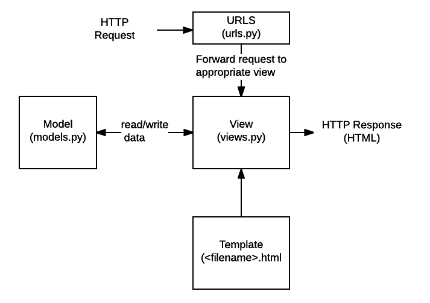

# Model

## 데이터베이스(DataBase)의 필요성
`05_form.md`에서 사용자가 입력한 데이터를 특정 함수의 인자 `request`로 전달 받아 변수로서 html에 사용해보았다.

하지만 사용자가 입력한 데이터는 일시적으로 저장될 뿐, 다음 입력값이 제출되면 이전 데이터를 찾을 수 없다. **입력받은 데이터를 영구적으로 저장**하기 위해서는 데이터를 **데이터베이스(DB)에 저장**해야 한다.

## Model
장고는 MTV 디자인 패턴을 따른다고 이전에 설명했다. MTV(Model Template View)에서 데이터베이스와 관련된 것이 Model이다.



모델은 데이터를 저장하는 데이터베이스(DB)를 관리한다. 모델은 class로 정의되며 하나의 class가 하나의 DB Table이다. 

## ORM(Object Relational Mapping)
장고에서는 파이썬 언어를 사용하고, DB에서는 SQL 언어를 사용하기 때문에 장고와 DB가 통신하는 것은 원칙적으로 불가능하다. 하지만 **ORM**이 중간다리 역할을 해준다. 
- ORM은 **객체(Python)와 관계(RDBMS-SQL)를 매핑(대응)해주는 작업**을 한다. 
- ORM으로 장고 Model에서 파이썬 코드로 DB를 조작할 수 있다.
- ORM의 역할을 하는 것은 다양하다. 대표적으로 파이썬에서는 `SQLalchemy` 가 있다. 하지만, 장고에서는 장고에 내장되어 있는 `Django ORM`만 사용해도 충분하다.
  
## 1. Local App `hospital` 생성 및 등록
`00_INTRO` 프로젝트 폴더에 Local App `hospital` 생성한다. `hospital` App의 `models.py`에서 클래스를 생성하여 DB의 Table과 어떻게 연결되는지 확인할 것이다.
```bash
$ python manage.py startapp hospital
```

`intro.settings`에서 `INSTALLED_APPS`에 `hospital` App을 등록한다.
```python
INSTALLED_APPS = [
    'django.contrib.admin',
    'django.contrib.auth',
    'django.contrib.contenttypes',
    'django.contrib.sessions',
    'django.contrib.messages',
    'django.contrib.staticfiles',
    'home',
    'form',
    'hospital',
]
```

## 2. `hospital` App 폴더 내의 `models.py`
`hospital` App 폴더 내의 `models.py`에서 `00_INTRO` 프로젝트의 DB와 연결될 class를 정의할 것이다. `models.py`에 정의하는 class는 해당 프로젝트의 `db.sqlite3`, DB인 SQL의 Table과 연결된다.
### 1. class `Patient` 정의
```python
from django.db import models

class Patient(models.Model):
    pass
```
- `Patient`는 클래스명으로 임의로 정한 것이기 때문에 다른 것으로 작성해도 괜찮다. 클래스명은 DB인 SQL에 전달될 때 `APP이름_클래스이름` 형태의 Table이 생성된다.
  - `hospital_patient`
- `class Patient(models.Model):` :  클래스 `Patient`가 `models`의 클래스 `Model`을 상속받는다는 의미이다.

## 3. `Patient`의 클래스 변수 생성
클래스 변수는 DB의 Table의 Column과 연결된다. 클래스 변수 `name`, `age`, `height`를 생성해 데이터 타입을 지정해주었다.
```python
from django.db import models

class Patient(models.Model):
    name = models.CharField(max_length=30)
    age = models.IntegerField()
    height = models.FloatField()
```
- `models.CharField(max_length=30)` : `models`의 클래스 `CharField`를 사용하여 문자열 타입의 데이터만 입력받을 수 있도록 데이터 타입 지정
  - 문자열 데이터에 대해서는 입력받을 수 있는 최대 길이 `max_length`를 지정해줘야 한다. 문자열 데이터가 입력받을 수 있는 최대길이를 30으로 지정해주었다.
- `models.IntegerField()` : `models`의 클래스 `IntegerField`를 사용하여 정수 타입의 데이터만 입력받을 수 있도록 데이터 타입을 지정
- `models.FloatField()` : `models`의 클래스 `FloatField`를 사용하여 실수 타입의 데이터만 입력받을 수 있도록 데이터 타입을 지정

### 4. 서버실행 후 DB 확인
처음으로 `model.py`에 클래스를 정의하고 서버를 실행하면 프로젝트 내부에 DB와 관련된 `db.sqlite3` 파일이 생성된 것을 확인할 수 있다.
```bash
$ python manage.py runserver
```

VSCode에서 아래 이미지처럼 'SQLite Viewer' extension을 설치하면 SQL이 보기 편해진다. 선택 사항이다.


`db.sqlite3` 파일에 들어가면 아래 이미지처럼 Table에 아무것도 없다는 것을 확인할 수 있다. 우리가 정의한 클래스 `Patient`를 DB의 Table에 전달해야 한다.


### 5. 클래스 DB화
1. 클래스 `Patient`를 DB의 Table에 전달하려면 터미널에서 아래와 같은 코드를 작성해야한다. 프로젝트 파일 경로에서 진행해야 한다.
```bash
$ python manage.py makemigrations hospital
```
- 터미널에서 코드를 실행하면 아래와 같이 응답받는다. `hospital` App 폴더에 하위폴더 `migrations`에 `0001_initial.py`가 생성되었다. 
```bash
Migrations for 'hospital':
  hospital\migrations\0001_initial.py
    - Create model Patient
```

- 생성된 `0001_initial.py` 파일을 확인하면 아래와 같다.
```python
# Generated by Django 5.0.1 on 2024-01-14 16:09

from django.db import migrations, models


class Migration(migrations.Migration):

    initial = True

    dependencies = [
    ]

    operations = [
        migrations.CreateModel(
            name='Patient',
            fields=[
                ('id', models.BigAutoField(auto_created=True, primary_key=True, serialize=False, verbose_name='ID')),
                ('name', models.CharField(max_length=30)),
                ('age', models.IntegerField()),
                ('height', models.FloatField()),
            ],
        ),
    ]
```
- 우리가 `hospital.models`에서 정의한 클래서 `Patient`에 대한 내용이 담겨있다. 클래스 변수인 `name`, `age`, `height` 외에 `id`가 생성된 것을 확인할 수 있다.
- `id`는 해당하는 클래스와 연동될 DB에서 데이터가 입력될 때마다 자동으로 생성하는 `primary_key` 칼럼(column)이다. `pk`는 `id`와 같은 클래스 변수로 사용된다.

2. 최종적으로 `0001_initial.py`에 저장된 내용을 DB에 전달하기 위해서 터미널에서 아래 코드를 작성한다. 프로젝트 파일 경로에서 작성해야 한다.
```bash
$ python manage.py migrate hospital
```
- 터미널에서 코드를 실행하면 아래와 같이 응답받는다. 
```bash
Operations to perform:
  Apply all migrations: hospital
Running migrations:
  Applying hospital.0001_initial... OK
```
3. `db.sqlite3` 파일을 새로고침하면 `hospital_patient` 테이블이 추가된 것을 확인할 수 있다. 컬럼에 Primary key인 `id`와 클래스 변수로 할당한 `name`, `age`, `height`가 컬럼명으로 들어가 있는 것을 확인할 수 있다.


`makemigrations`, `migrate` 코드를 통해 `hospital` App의 `models.py`에 정의한 클래스 `Patient`를 DB인 SQL Table로 이주(migrate)시킨 것이다.

## `django_extensions` 설치
터미널에서 아래 코드를 입력해 `django_extensions` 설치해준다. 해당 프로젝트 경로에서 실행한다.
```bash
$ pip install django_extensions
```
- `django_extensions`는 장고에서 공식적으로 만든 App이 아니라 다른 팀에서 장고 라이브러리로 만든 것이다. 
- `django_extensions`를 설치하면 `shell_plus` 기능을 사용할 수 있다.
- 이렇게 3rd Party Apps로 설치한 외부 라이브러리 App은 프로젝트의 마스터(관리) 폴더의 `settings.py`의 `INSTALLED_APPS`에 등록해줘야 한다.

```python
INSTALLED_APPS = [
    # 장고 기본 Apps
    'django.contrib.admin',
    'django.contrib.auth',
    'django.contrib.contenttypes',
    'django.contrib.sessions',
    'django.contrib.messages',
    'django.contrib.staticfiles',

    # 3rd Party Apps
    'django_extensions',

    # Local Apps
    'home',
    'form',
    'hospital',
]
```
- 기본 설치 APPS, 3rd Party APPS, Local APPS을 구분해서 `INSTALLED_APPS` 리스트에 추가하는 것이 좋다.
    - **3rd Party App**은 `pip`로 설치한 APP, 즉 외부 라이브러리 앱을 의미
    - **Local APP**은 장고에서 `python manage.py startapp`으로 직접 생성한 앱을 의미
  - 3rd Party Apps 설치 후 혹은 Local Apps 생성 후에는 반드시 `settings.py`의 `INSTALLED_APPS`의 리스트에 관련 Apps를 등록해야 작동한다.
  - APP을 추가 작성한 마지막에 **Trailing Commas(`,`)** 를 작성해줘야 한다.

#### `shell_plus`
터미널에서 `shell_plus`를 사용하면 기존 `shell`보다 편하게 사용할 수 있다. `hospital.models`의 클래스와 연결된 SQL Table에 데이터 CRUD(생성, 조회, 수정, 삭제)를 할 때 `shell_plus`를 사용할 것이다.

터미널에서 아래 코드를 입력후 실행하면 `shell_plus`를 터미널로 사용할 수 있다.
```bash
$ python manage.py shell_plus
```

 `shell_plus`가 아래처럼 터미널에 나타나는 것을 확인할 수 있다.
 

 ## 데이터베이스의 CRUD
 데이터베이스의 역할은 CRUD Operations 4가지만 가능하다.
 - 생성, 수정, 삭제는 DB의 데이터가 바뀐다. 즉, 위험도가 높다.
 - 조회는 DB의 데이터를 탐색하는 것이기 때문에 상대적으로 위험도가 낮다.

|DB의 기능| 영어 표현|
|---|---|
|생성|Create|
|조회|Read/Retrieve|
|수정|Update|
|삭제|Delete/Destory|