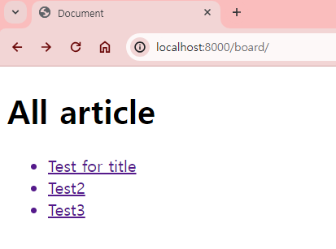

# ModelForm

`05_form.md`에서 정리한 Form과 `06_model.md`에서 정리한 Model을 활용해 Form에 사용자가 입력한 데이터를 DB에 저장하도록 아래와 같이 설계해보자.

1. `00_INTRO` 프로젝트에서 `board` App 생성
2. `Article` 모델 클래스 정의
   1. `title` 컬럼 => `CharField(300)`
   2. `content` 컬럼 => `TextField()`
3. `Article` 모델 클래스 데이터 베이스에 반영
4. 사용자 데이터를 입력받아 `Article` 모델과 연동해 DB에 저장할 수 있는 `ArticleForm` ModelForm 생성
5. `Article` 모델에 대해 CRUD가 이루어질 수 있게 URL, View, Template 설정

## 1. Local App `board` 생성 및 등록
`01_INTRO` 프로젝트 경로에서 터미널에 아래 코드를 입력
```bash
$ python manage.py startapp board
```

`intro.settings`에 `board` App 등록
```python
INSTALLED_APPS = [
    # 장고 기본 Apps
    'django.contrib.admin',
    'django.contrib.auth',
    'django.contrib.contenttypes',
    'django.contrib.sessions',
    'django.contrib.messages',
    'django.contrib.staticfiles',

    # 3rd Party Apps
    'django_extensions',

    # Local Apps
    'home',
    'form',
    'hospital',
    'board',
]
```

## 2. Model 생성
`board` App의 `Article` 모델을 생성한다. 즉 `board.models`에서 클래스 `Article`을 정의한다.
```python
from django.db import models

class Article(models.Model):
    title = models.CharField(max_length=100)
    content = models.TextField()
```
`Article` 모델을 DB에 이주(migrate)시킨다.
```bash
$ python manage.py makemigrations board

$ python manage.py migrate board
```
위 코드를 실행하면 `db.sqlite3` 파일에 `board_article` 테이블이 생성된다.

## 3. ModelForm 생성
ModelForm은 Model에서 정의한 필드대로 form을 자동으로 만들어 준다. 모델과 관련된 form은 대부분 ModelForm을 사용한다. 

기존의 HTML의 `<form>`을 이용하지 않고 ModelForm으로 form을 생성해 사용자 입력 데이터를 `Article` 모델과 연결해 DB에 데이터를 저장하겠다.

### 1. Form에 유효성 검사가 필요한 이유
사용자 입력에는 다양한 가능성이 있기 때문에 **원하는 형태의 데이터를 받기 위해서는 입력에 대한 제한을 설정**해야 한다. 즉, 사용자 입력 데이터가 설정해 놓은 데이터 형식을 따르는지 검증해야 한다. 이를 **데이터 유효성 검사(Validation)** 라고 한다.

- Model에서 필드의 데이터 타입과 HTML `<form>`은 데이터 유효성 검사를 할 수 없다.
  - Model에서 `models.py` 모듈을 가져와 `CharField(min_length=2, max_length=100)`과 같이 사용자 입력 데이터에 대해 제한을 줄 수 있다. 생성한 Model에 맞게 `<form>`의 `type` 속성이나 `required` 등을 통해 **HTML 차원에서 일차적으로 사용자 입력 데이터에 대한 조건을 걸러줄 수 있다.**
  - 하지만 HTML은 **유효하지 않은 사용자 데이터가 제출되어 DB에 저장될 가능성이 있다.**
    - 브라우저에서 해당 URL 페이지를 요청해 Form이 있는 html이 렌더링되면 개발자 도구 `elemnet` 탭에서 조건에 대한 부분을 제거하여 조건에 맞지 않는 Form 제출할 수 있다.
    - ex. 문자열 데이터 입력창에 `min_length=2`에 대한 부분을 제거하고 아무 내용도 적지 않은 채로 Form을 제출할 수 있다.
  - 유효하지 않은 사용자 데이터가 제출되면 **DB에 저장하는 과정에서 에러**가 발생할 수 있다.
    - 문자열의 경우 빈 문자열을 데이터로 저장하지만, 정수/실수에 아무 데이터도 입력하지 않고 제출하면 에러가 발생한다. DB는 기본적으로 무결성의 원칙에 따라 데이터가 없는 Null을 저장할기 때문이다.


### 2. ModelForm의 역할
1. **검증 및 저장**
   - 사용자 입력 데이터가 설정해 놓은 데이터 형식을 따르는지 검증(Validation)한다. 데이터 유효성을 자동으로 검사하고 올바르지 않은 데이터를 입력했을 경우 에러 메세지와 함께 사용자에게 알려준다.
   - 검증된 데이터를 DB에 저장하는 역할도 수행한다.
   - 전제 조건 : 해당 Model의 `class Meta`에서 `fields`에 입력된 필드에 대해만 검증 및 저장한다.

2. **사용자 입력과 관련된 HTML 생성**
   - `<input>`, `<textarea>`와 같은 사용자 입력과 관련된 HTML을 자체적으로 생성할 수 있다. 즉, html 문서에서 `<form>` 내부에 들어갈 사용자 입력 관련 태그를 ModelForm으로 대체할 수 있다.
   - 따라서 Form을 위한 HTML을 따로 작성할 필요 없다.
   - `class Meta`에서 `model`, `fields`에 지정된 특정 모델의 특정 필드를 자동으로 Form 필드로 생성하기 때문에 Form 필드를 중복해서 정의할 필요 없다. 
   - 하지만 ModelForm도 연동된 모델의 필드를 재정의하고 `widget`을 통해 HTML 요소를 추가할 수 있다.

### 3. `Article` 모델과 연결할 ModelForm 생성
`board` App 폴더에서 `forms.py`를 생성한다. `board.forms` Article 모델과 연동될 ModelForm을 생성할 것이다.

#### 1. `ArticleForm` 생성
```python
from django import forms

class ArticleForm(forms.ModelForm):
    pass
```
- 클래스 `ArticleForm`을 생성하기 전에, 장고에서 제공하는 `forms.py` 모듈을 가져와 클래스 `ModelForm`을 상속해준다.


#### 2. `ArticleForm`의 `Meta` 클래스 생성
```python
from django import forms
from .models import Article

class ArticleForm(forms.ModelForm):

    class Meta:
        model = Article
        
        fields = ('title', 'content', )
```
1. 특정 모델과 ModelForm을 연결하기 위해서 `ArticleForm` 내부에 `class Meta:`를 작성해준다. 
   - `class Meta` : 파이썬의 metaclass에 대한 내용이 아니라, 장고에서만 사용되는 개념으로 `Meta`는 Metadata(메타데이터)를 의미한다. 메타데이터는 데이터에 대한 데이터로 부모 클래스에 대한 추가적인 정보를 나타낸다. 

2. ModelForm의 `Meta` 클래스는 클래스 변수로 `model`이 있어야 한다. `model`에 연결하고 싶은 `Article` 모델을 할당한다. 
   - 현재 `board.forms`에는 `Article` 모델이 없기 때문에 `from .models import Article`로 가져온다.
     - `.models` : 현재 경로에 있는 `models.py`, 즉 `board.models`를 의미한다.
3. ModelForm의 `Meta` 클래스는 클래스 변수로 `fields` 혹은 `exclude`가 있어야 한다. `Meta` 클래스의 `model`에 할당한 모델의 필드 중 어떤 필드를 검증 및 저장할지 지정하는 역할이다.
   - `ArticleForm`에 연결된 `Article` 모델에는 `id(pk)`필드를 제외하면 `title`과 `content`가 있다. 
   - `fields`는 지정한 필드명을 리스트/튜플에 담고 지정한 필드명에 대해서만 검증하고 저장한다.
     - `fields = '__all__'` : 모든 필드을 사용하고 싶으면 `'__all__'`을 할당하면 된다.
     - `fiedls = ('title', 'content', )` : 특정 필드만 지정하고 싶다면 리스트 혹은 튜플 형태로 넣어준다. 마지막에 `,`는 트레일링 콤마로 사용했다. 
       - `fiedls = ('title', 'content', )`는 `fiedls = [(]'title', 'content', ]`로 표현해도 같은 의미이다. 
       - 현재 모델에서 필드가 `title`, `content`밖에 없기 때문에 `fiedls = ('title', 'content', )`는 `fields = '__all__'`와 같은 의미이다. 추후 모델에 필드를 추가하여 migration하면 다른 의미가 될 것이다.
   - `exclude`는 지정한 필드명을 리스트/튜플에 담고 지정한 필드명에 대해서만 제외하고 나머지 필드명에 대해서만 검증하고 저장한다.
     - `exclude = ('title', )` : `title` 필드를 제외하고 나머지 `content` 필드만 검증 및 저장한다는 의미이다.


#### 3. `ArticleForm`의 사용자 입력할 부분 생성
`Article` 모델에서 `title`, `content` 클래스 변수(필드)를 만들었었다. `ArticleForm`에도 사용자가 입력할 `<input>` 등을 `ArticleForm`의 클래스 변수로 만들 수 있다.

`Article` 모델의 필드를 그대로 사용한다면 `ArticleFrom`의 클래스 변수를 중복해서 정의하지 않아도 된다. `Meta` 클래스의 `model`과 `fields` 혹은 `exclude`를 지정하면 ModelForm이 자동으로 필드를 생성한다. 


```python
from django import forms
from .models import Article

class ArticleForm(forms.ModelForm):
    title = forms.CharField(min_length=2, max_length=100)
    content = forms.CharField(min_length=2)
    
    class Meta:
        model = Article
        
        fields = ('title', 'content', )
```
- `ArticleForm`의 클래스 변수 `title`은 문자열 형태의 데이터 중 글자의 최소 길이가 2이고, 최대 길이가 100인 데이터만 받을 수 있도록 제한 조건을 설정했다.
  - `forms.CharField()` : `forms.py` 모듈에서 `CharField` 클래스는 사용자 입력창에 문자열 형태의 데이터를 받겠다는 의미이다. `CharField` 클래스의 속성(클래스 변수)을 이용해 사용자 입력을 제한할 수 있는 조건을 넣을 수 있다.
  - `max_length` : 문자열 글자의 최대 길이 지정
  - `min_length` : 문자열 글자의 최소 길이 지정
  - html의 `<textarea>` 를 대신할 `TextField`는 없기 때문에 `content`에 대해 `CharField`를 사용했다.

- `ArticleForm`의 클래스 변수 `content`은 문자열 형태의 데이터 중 글자의 최소 길이가 2인 데이터만 받을 수 있도록 제한 조건을 설정했다.

`ArticleForm`의 클래스 변수 `title`과 `content`는 연결된 `Article` 모델의 클래스 변수에 대해 유효성 검사를 하고 싶은 조건에 대해 다시 지정해주는 것이다.

`CharField` 외에도 정수를 받는 `IntegerField`, 소수를 받는 `FloatField`, 날짜에 대한 `DateField` 등 `forms.py` 모듈에서 다양한 클래스를 활용해 사용자 입력에 제한을 줄 수 있다.

## 4. ROOT URL `intro.urls` 포워딩
`intro.ulrs` 에서 `http://localhost:8000/board/` URL로 요청할 때 `board.urls`로 포워딩되도록 URL 경로를 설정한다.
```python
from django.contrib import admin
from django.urls import path
from django.urls import include, path


urlpatterns = [
    path('admin/', admin.site.urls),
    path('home/', include('home.urls')),
    path('form/', include('form.urls')),  
    path('board/', include('board.urls')),

]
```


## 5. Article 모델 데이터 생성
### 1. `board.urls` URL 설계 - 모델의 데이터 생성
`board.urls`에서 설계에 필요한 URL 경로를 설정한다. 먼저 `Article` 모델의 데이터 생성을 담당할 `create_article`과 생성된 데이터를 상세 페이지로 렌더링할 `detail_article`을 설계해보자.
```python
from django.urls import path
from . import views

app_name = 'board'

urlpatterns = [
    path('create_article/', views.create_article, name='create_article'),
    path('<int:article_pk>/', views.detail_article, name='detail_article'),
]
```
1. 필요한 `path`와 `views`를 가져온다.
2. `board` App URL 네임스페이스로 `'board'`를 매핑한다.
3. `ArticleForm`을 이용해 사용자에게 입력받고 DB에 저장할 수 있는 `'create_article/'` URL 경로, 함수, 별칭을 지정한다.
4. `Article` 모델의 `pk`필드에 저장되는 필드값을 `article_pk`라고 URL 변수로 설정한다.
 `Article.objects.get(pk=article_pk)`로 해당하는 DB의 필드값(사용자 입력 데이터)을 확인할 수 있는 `'<int:article_pk>/'` URL 경로, 함수, 별칭을 지정한다.

### 2.View - `create_article` 함수 정의
`ArticleForm`을 사용자에게 입력받고 DB에 저장할 수 있는 `create_article` 함수를 정의한다.

Form의 유효성 검사를 하기 위해 ModelForm을 사용해 `ArticleForm`을 생성했었다. `board.views`에서 `create_article` 함수에 조건을 통해 두 가지 기능을 수행하도록 만든다. 
   1. **'GET' 방식으로 요청시** : 사용자가 입력할 수 있는 `ArticleForm`이 담긴 `form.html`이 렌더링 사용자 입력 데이터를 제출시 `/board/create_article/` URL로 요청
   - HTTP request method가 'GET'일 때, 사용자가 입력할 수 있는 비어있는 `ArticleForm`이 있는 `form.html`을 렌더링하도록 응답한다. 
   - `ArticleForm`에 사용자가 데이터를 입력하여 제출시 HTTP request method가 'POST' 방식으로 `board/create_article/` ULR이 요청되어 `create_article` 함수가 실행된다. 
   2. **'POST' 방식으로 요청시** : 사용자 입력 데이터가 유효성 검사 실시
   - 사용자 입력 데이터가 유효하면 : 입력 데이터를 `Article` 모델과 매핑된 DB에 저장하고 저장된 데이터의 pk를 변수로 활용해 `/board/<int:article_pk>/` URL이 재요청(`redirect`)되어 방금 저장된 Form 데이터의 내용을 볼 수 있는 html 문서를 렌더링하다.
   - 사용자 입력 데이터가 유효하지 않으면 : 사용자가 유효한 데이터를 입력할 수 있도록 'GET' 방식으로 `/board/create_article/` URL을 요청

### 3. Model과 ModelForm 가져오기
생성한 `Article` Model과 `ArticleForm`을 가져온다.
```python
from django.shortcuts import render
from .models import Article
from .forms import ArticleForm
```
- `.models`는 현재 경로의 `models.py` 모듈을 의미한다. 즉 `board.models`이다.
- `.forms`는 현재 경로의 `forms.py` 모듈을 의미한다. 즉 `board.forms`이다.

### 4. HTTP request method 에 대한 if 조건문 작성
HTTP request method는 'GET'과 'POST' 두 가지이다. `if` 조건문으로 HTTP request method를 'GET'과 'POST'로 각각 조건을 설정해준다. 조건이 오는 순서는 바뀌어도 상관없지만, 보통 'POST' 방식을 먼저 조건으로 걸도록 작성한다.

```python
from django.shortcuts import render
from .models import Article
from .forms import ArticleForm

def create_article(request):
    if request.method == 'POST':
        pass
    elif request.method == 'GET':
        pass
```

### 5. HTTP request method - 'GET' 일 때
```python
from django.shortcuts import render
from .models import Article
from .forms import ArticleForm

def create_article(request):
    if request.method == 'POST':
        pass
    elif request.method == 'GET':
        form = ArticleForm()
        return render(request, 'board/form.html', {'form': form, })
```

1. `form = ArticleForm()`으로 `ArticleForm`의 인스턴스로 `form`을 만들어준다. 
2. HTTP request method가 'GET'일 때 `form`이 담긴 `form.html`이 렌더링 되도록 `render` 함수를 사용한다.
   1.  `render` 함수는 첫 번째 인자로 `request`를 받는다.
   2.  `render` 함수는 두 번째 인자로 렌더링할 Template 경로를 받는다. 현재 경로에서 자동으로 `templates/` 폴더를 찾아 그 안의 Template을 찾기 때문에 `board/form.html`만 작성한다.
   3.  `{'form': form, }` : `form.html`에 `form`을 변수로 사용할 수 있도록 context로 넘겨준다.

`http://localhost:8000/board/create_article/` URL을 주소창에 입력해 페이지로 이동하면 'GET' 방식으로 요청된다. 해당 URL 요청으로 `create_article` 함수가 실행되고, `elif request.method == 'GET':`에 대한 조건에 True가 되어 사용자가 입력하기 전 비어있는 `ArticleForm`이 있는 `form.html`을 렌더링해 응답한다.

### 6. Template - `form.html` 생성
```html





```
- `board/templates/board/form.html` 경로에 맞게 `form.html`을 생성한다. 기본 템플릿 `base.html`을 상속받는다.

```html



<h1>Article Form</h1>
<form action="">
</form>

```
- `<h1>`으로 `Article Form`이라고 제목을 만들어주고 `<form>`을 만든다.

```html



<h1>Article Form</h1>
<form action="">
    {{ form }}
    <div>
        <button>제출</button>
    </div>    
</form>

```
- `{{ form }}`  : `<form>` 안에 context로 넘긴 `form`을 DTL로 넣어준다. 사용자가 입력하기 전 비어있는 `ArticleForm`이 나올 것이다.
- `<form>` 안에 Form을 제출할 수 있는 제출 버튼을 `<button>`으로 생성한다. `<form>` 안에 `<button>`은 `<input type="submit">`과 같은 역할을 한다.

```html



<h1>Article Form</h1>
<form action="" method="POST">
    
    {{ form }}
    <div>
        <button>제출</button>
    </div>
</form>

```
- 사용자가 Form을 작성하고 제출하면 `board:create_article`로 요청한다. 즉, `'/board/create_article/'` URL로 요청하여 `create_article` 함수가 실행되도록 한다.
- `<form>`의 method는 POST로 한다. POST방식으로 넘겨야 사용자가 입력한 데이터에 대해 공개되지 않는다.
- HTTP request method가 POST 방식이면 `csrf_token`이 보안상 필요하다. `<form>` 안에 DTL로 `csrf_token`을 넣어준다. 

### 7. 브라우저에서 확인
서버를 실행하고 브라우저에 `http://localhost:8000/board/create_article/` URL로 접속하면 `GET` 방식으로 URL이 요청되었기 때문에 비어있는 `ArticleForm`, 즉 `form`이 담긴 `form.html`이 렌더링되어 응답한다.


### 8. `boards.forms` - `ArticleForm` 수정
`ArticleForm`에서 `content` 필드를 정의할 때 Form field에 `TextField`가 없어서 `CharField`를 설정했다. 만약 HTML 상에서 `<textarea>`로 렌더링하고 싶다면 `widget`으로 설정해줄 수 있다.
```python
from django import forms
from .models import Article

class ArticleForm(forms.ModelForm):
    title = forms.CharField(min_length=2, max_length=100)
    content = forms.CharField(min_length=2, widget=forms.Textarea())
    
    class Meta:
        model = Article
        
        fields = ('title', 'content', )
```

- `widget=forms.Textarea()` : `content` 필드가 `<textarea>` 태그로 감싸져서 랜더링된다. `widget`을 통해서 `content`에서 `CharField`를 `Textarea`타입으로 랜더링했다. 필드인 `CharField`와 다른 필드(`Textarea`)의 위젯을 사용하고 싶으면 위젯을 필드(`CharField`)의 인자로 사용한다.
- Widget : Django의 HTML input 요소를 표현하는 것으로 HTML 랜더링을 처리한다. ModelForm의 필드(`forms.CharField()`)는 input의 유효성을 처리하는 것이고, Widget(`forms.Textarea()`)은 단순히 HTML에서 랜더링을 처리하는 보여지는 요소라는 것을 구분하자.


- 웹 페이지에서 확인하면 위 이미지와 같이 나온다.

### 9. View - `create_article` 함수 재정의
`if request.method == 'POST':` 조건을 만족할 때 `return`을 작성한다.

```python
from django.shortcuts import render
from .models import Article
from .forms import ArticleForm

def create_article(request):
    if request.method == 'POST':
        form = ArticleForm(request.POST)
        return pass
    elif request.method == 'GET':
        form = ArticleForm()
        return render(request, 'board/form.html', {'form': form, })
```
- `form = ArticleForm(request.POST)` : `ArticleForm`의 인자로 `request.POST`를 넣어서 사용자가 입력한 데이터가 담긴 `ArticleForm`으로 만들어준다. ` ArticleForm(request.POST)`의 인스턴스로 `form`을 생성한다.

```python
from django.shortcuts import render
from .models import Article
from .forms import ArticleForm

def create_article(request):
    if request.method == 'POST':
        form = ArticleForm(request.POST)
        if form.is_valid():
            pass
        else:
            pass
    elif request.method == 'GET':
        form = ArticleForm()
        return render(request, 'board/form.html', {'form': form, })
```
- ModelForm을 사용해서 사용자가 입력한 데이터 유효성 검사를 하기로 했다.
- `is_valid()` 함수를 이용해 if 조건문을 만들어 준다.

```python
from django.shortcuts import render
from .models import Article
from .forms import ArticleForm

def create_article(request):
    if request.method == 'POST':
        form = ArticleForm(request.POST)
        if form.is_valid():
            form.save()
        else:
            pass
    elif request.method == 'GET':
        form = ArticleForm()
        return render(request, 'board/form.html', {'form': form, })
```
- `if form.is_valid():` : 사용자 입력 데이터가 담긴 `form`이 유효할 때
- `form.save()` :  `form`에 `save()` 메서드를 활용해 DB에 저장한다.
  - `form`은 `ArticleForm(request.POST)`의 `model`로 설정된  `Article` 모델의 인스턴스이다.
  - 즉, `form`을 통해서 `Article`을 저장하는 것이다.

데이터를 저장한 후, 해당 데이터의 상세 페이지로 이동할 수 있도록 `detail_article` 함수를 먼저 정의하겠다.

### 10. View - `detail_article` 함수 정의
`/board/<int:article_pk>/`URL 요청시 `detail_article` 함수가 실행된다. `Article` 모델의 `pk` 필드에 필드값이 `article_pk`인 객체에 대해  `title`, `content` 필드값, 즉 해당 pk에 저장된 사용자 입력 데이터를 정리한 상세 페이지가 렌더링되는 `detail_article` 함수를 정의한다.

```python
from django.shortcuts import render
from .models import Article
from .forms import ArticleForm

def create_article(request):
    if request.method == 'POST':
        form = ArticleForm(request.POST)
        if form.is_valid():
            form.save()
        else:
            pass
    elif request.method == 'GET':
        form = ArticleForm()
        return render(request, 'board/form.html', {'form': form, })

def detail_article(request, article_pk):
    article = Article.objects.get(pk=article_pk)
    retrun render(request, 'board/detail.html', {'article': article, })
```
- `def detail_article(request, article_pk):` : 동적 라우팅으로 URL 경로에 변수가 들어가기 때문에 함수의 두 번째 인자에 변수 `article_pk`를 넣어준다.
  - `Article` 모델의 `pk`필드에 저장되는 필드값을 `article_pk`라고 URL 변수로 설정했다.
- `article = Article.objects.get(pk=article_pk)` : `Article` 모델의 `pk` 필드에 필드값이 `article_pk`인 DB의 row 데이터를 객체를 `article` 변수에 할당한다.
- `article`을 `detail.html`에서 변수로 활용할 수 있도록 context로 넘겨준다.


### 11. Template - `detail.html` 생성
```html



<h1>{{ article.title }}</h1>
<p>
    {{ article.content | linebreaksbr}}
</p>

```
- `base.html`을 기본 템플릿으로 상속한다.
- context로 넘긴 `article`의 `title`과 `content`의 필드값을 DTL을 통해 작성한다.
- `content` 필드에 여러 줄의 입력값을 html 상에서는 엔터가 아닌 하나의 공백으로 받기 때문에, 입력 데이터를 입력한 줄대로 보여주기 위해 DTL 필터로 `linebreaksbr`를 작성했다. 


### 12. View - `create_article` 함수 재정의
```python
from django.shortcuts import render, redirect
from .models import Article
from .forms import ArticleForm

def create_article(request):
    if request.method == 'POST':
        form = ArticleForm(request.POST)
        if form.is_valid():
            article = form.save()
            return redirect('board:detail_article', article.pk)
        else:
            return render(request, 'board/form.html', {'form': form, })
    elif request.method == 'GET':
        form = ArticleForm()
        return render(request, 'board/form.html', {'form': form, })

def detail_article(request, article_pk):
    article = Article.objects.get(pk=article_pk)
    retrun render(request, 'board/detail.html', {'article': article, })
```
#### 1. `form`이 유효할 때
- `article = form.save()` : `save()`메서드는 form을 DB에 저장하고 저장된 row의 QuerySet 객체를 반환한다. `Article`모델의 객체에 대해 `article` 인스턴스를 생성한다.
- `from django.shortcuts import render, redirect` : `redirect` 함수를 사용하기 위해 가져온다.
- `redirect` 함수를 실행하면 **지정한 URL 경로로 재요청**한다. `redirect` 함수는 첫 번째 인자로 요청할 URL 경로를 필수적으로 받는다.
- `return redirect(request, 'board:detail_article' article.pk)` 
  - 유효한 사용자 입력 데이터가 DB에 저장되면 `board:detail_article` URL 경로로 재요청한다. 즉, `/board/<int:article_pk>/` URL을 요청하기 때문에 `article_pk`를 `redirect`의 두 번째 인자로 받아줘야 한다. 
  - `article = form.save()`로 저장된 `Article`모델의 인스턴스 `article`을 활용해 `article`의 `pk` 필드값 `article.pk`을 찾아준다. 매개변수 `article_pk`를 받아줄 `redirect`의 두 번째 인자로 `article.pk`를 작성한다.


최종적으로 `create_article`가 실행될 때 `form`이 유효하면 `form`은 DB에 저장되고, 저장된 데이터에 해당하는 `board:detail_article` URL 경로가 요청되어 `detail_article` 함수가 실행되어 `detail.html`이 렌더링 된다.

#### 2. `form`이 유효하지 않을 때
- `form`을 DB에 저장하지 않고, 작성된 `form`을 수정하도록 `board/form.html`이 랜더링되도록 한다.

```python
from django.shortcuts import render, redirect
from .models import Article
from .forms import ArticleForm

def create_article(request):
    if request.method == 'POST':
        form = ArticleForm(request.POST)
        if form.is_valid():
            article = form.save()
            return redirect('board:detail_article', article.pk)
    elif request.method == 'GET':
        form = ArticleForm()
    return render(request, 'board/form.html', {'form': form, })

def detail_article(request, article_pk):
    article = Article.objects.get(pk=article_pk)
    retrun render(request, 'board/detail.html', {'article': article, })
```
- 현재 'POST' 방식으로 요청되고 `form`이 유효하지 않을 때와 'GET' 방식으로 요청될 때 `return`되는 내용이 같다. 들여쓰기(indent)를 활용해 중복된 내용을 삭제한다.
- 'POST'과 'GET'방식으로 요청될 때 `form`은 다른 내용을 담고 있다. 각각 사용자가 입력한 데이터가 담긴 `ArticleForm(request.POST)`과 `ArticleForm()`으로 다른 `form`이 `board/detail.html`에 랜더링될 것이다.
```python
from django.shortcuts import render, redirect
from .models import Article
from .forms import ArticleForm

def create_article(request):
    if request.method == 'POST':
        form = ArticleForm(request.POST)
        if form.is_valid():
            article = form.save()
            return redirect('board:detail_article', article.pk)
    else:
        form = ArticleForm()
    return render(request, 'board/form.html', {'form': form, })

def detail_article(request, article_pk):
    article = Article.objects.get(pk=article_pk)
    retrun render(request, 'board/detail.html', {'article': article, })
```

- HTTP request method는 'GET'과 'POST'방식 두 가지이기 때문에 `elif request.method == 'GET':`를 `else`로 수정해도 무관하다.

### 13. 브라우저 및 DB 확인
#### 1. 유효한 form 제출시

- 위와 같이 form에 입력후 제출


- 제출 후 해당 form 데이터 내용이 담긴 상세페이지 랜더링


- 입력한 데이터가 DB에 저장된 것 확인

#### 2. 유효하지 않은 form 제출시

- 일차적으로 HTML에서 조건에 맞지 않은 입력 데이터를 걸러준다.

개발자 도구에서 `title`, `content` 필드의 `min_length=2`를 지우고 form을 제출해보겠다.


- ModelForm을 이용해 유효성 검사를 하도록 조건을 설정했기 때문에 위 이미지와 같이 조건을 만족시킨 form을 다시 작성하도록 요구한다.
- 유효하지 않은 입력 데이터가 담겨있는 form이 입력창에 들어가있는 것을 확인할 수 있다.


## 6. `Article` 모델 데이터 조회
`Article` 모델에 저장된 전체 데이터의 `title` 필드를 조회할 수 있는 URL, View, Template을 정의한다.

### 1. URL Conf - `board.urls`
```python
from django.urls import path
from . import views

app_name = 'board'

urlpatterns = [
    path('create_article/', views.create_article, name='create_article'),
    path('<int:article_pk>/', views.detail_article, name='detail_article'),
    path('', views.index_article, name='index_article'),
]
```
`http://localhost:8000/board/` URL로 요청시 `index_article` 함수가 실행되고 URL 별칭으로 `index_article`을 매핑했다.

### 2. View - `index_article` 함수 정의
`board.views`에서 `index_article` 함수 정의한다.

```python
def index_article(request):
    articles = Article.objects.all()
    return render(request, 'board/index.html', {'articles': articles, })
```
- `Article` 모델의 모든 row를 객체로 받는 `articles` 인스턴스를 생성한다.
- `render` 함수를 사용해 `board/index.html`가 랜더링되게 하고, `articles` 변수를 context로 넘겨준다.

### 3. Template - `index.html` 생성
`/board/templates/board/` 경로에 `index.html` 문서를 생성한다.
```html




<ul>
    
    <li>{{ article.title }}</li>
    
</ul>

```
- `base.html`을 기본 템플릿으로 상속한다.
- `<h1>`으로 적절한 제목을 작성한다.
- for 문을 사용해서 `articles`를 순회하여 `Article` 모델에 저장된 전체 데이터의 `title` 필드값이 리스트에 들어가도록 작성한다.

```html



<h1>All article</h1>
<ul>
    
    <a href="">
        <li>{{ article.title }}</li>
    </a>
    
</ul>

```
- `<a>`를 활용해 `{{ article.title }}`을 클릭하면 해당 하는 `article`의 상세 페이지로 이동하도록 설정한다.
- `board:detail_article` URL 경로는 `article_pk`를 URL 주소의 변수로 가지고 있다. `article_pk`는 `Article`모델의 `pk`필드의 값을 의미하기 때문에 for문에서 범위를 순회하여 가져오는 `article`변수를 이용해 `article.pk`로 넣어준다.

### 4. 브라우저에서 확인
`/board/create_article/` URL을 요청해 DB에 추가적으로 데이터를 생성하고 `/board/`를 확인해본다.


- DB에 저장된 모든 `Article`모델의 `title` 필드의 값이 리스트로 나열된 것을 확인할 수 있다.
- 각 리스트에 해당하는 `title` 필드의 데이터를 클릭하면 해당 상세페이지로 요청된다.


## 7. `Article` 모델 데이터 수정
`Article` 모델에 저장된 데이터를 수정할 수 있는 URL, View, Template을 작성한다.

### 1. URL Conf - `board.urls`
```python
from django.urls import path
from . import views

app_name = 'board'

urlpatterns = [
    path('create_article/', views.create_article, name='create_article'),
    path('<int:article_pk>/', views.detail_article, name='detail_article'),
    path('', views.index_article, name='index_article'),
    path('<int:article_pk>/update_article/', views.update_article, name='update_article'),
]
```
`http://localhost:8000/board/<int:article_pk>/update_article/` URL로 요청시 `update_article` 함수가 실행되고 URL 별칭으로 `update_article`을 매핑했다.

### 2. Template - `detail.html`에서 수정버튼 추가
게시글의 상세페이지에 해당 게시글을 수정할 수 있는 수정버튼을 추가한다.
```html



<h1>{{ article.title }}</h1>
<p>
    {{ article.content | linebreaksbr }}
</p>
<div>
    <a href="">
        <button>게시글 수정</button>
    </a>
</div>

```
- `<a>` 태그 안에 `<button>` 태그로 게시글 수정버튼을 만들어 준다.
  - `<a>` 태그로 URL 연결시 HTTP request method가 'GET'이 된다.
- `<a>` 태그에 연결될 하이퍼링크 경로를 `board:update_article`로 설정해 해당 게시물을 수정할 수 있는 `update_article` 함수가 실행되도록 한다.
  - 해당 URL 경로는 `article_pk` 변수로 `Article`의 `pk` 필드 값인 `article.pk`를 넣어준다.


### 3. View - `update_article` 함수 정의
#### 'GET' 방식으로 요청할 때
`update_article` 함수도 `create_article` 함수처럼 'Get' 방식으로 요청될 때 해당 게시물을 수정하고 'POST' 방식으로 요청될 때 해당 게시물을 저장하도록 조건을 달아준다.

```python
def update_article(request, article_pk):
    article = Article.objects.get(pk=article_pk)
    if request.method == 'POST':
        pass
    else:
        form = ArticleForm(instance=article)
        return render(request, 'board/form.html', {'form': form,}) 
```
- `pk` 필드가 `article_pk`인 `Article` 모델의 인스턴스 `article`을 생성한다.
- Http request method가 'GET'일 때 `ArticleForm(instance=article)`의 인스턴스 `form`을 생성한다.
- 만약 `ArticleForm()`으로 작성하면 `form`은 사용자가 입력하기 전 비어있는 form이 나올 것이다.
- 기존에 저장된 DB의 데이터를 가져올 것이기 때문에 `instance` 옵션을 사용한다.
- `instance=article`로 찾아갈 인스턴스를 설정해준다. 위에서 `article_pk`로 조회한 `article` 인스턴스를 조회해 해당 필드값을 가져온다.

브라우저 주소창에서 `/board/<int:article_pk>/update_article/` URL을 요청했을 때 `Article` 모델의 `pk` 필드가 `article_pk`인 row 데이터의 필드값이 담긴 ArticleForm이 `form.html`에 랜더링 될 것이다.

### 4. Template - `form.html` 수정
```html



<h1>Article Form</h1>
<form method="POST">
    
    {{ form }}
    <div>
        <button>제출</button>
    </div>
</form>

```
- `<form>`의 속성 `action`이 공란이면 자동으로 현재 주소창에 있는 URL 경로로 요청된다. `create_article` 함수와 `update_article` 함수에서 둘 다 form 제출시 현재 주소창의 URL로 요청될 수 있게 `form.html`에서 `action=""`을 삭제해준다.

### 5. 브라우저에서 확인
`/board/create_article/`과 `/board/<int:article_pk>/update_article/` URL 요청시 각각 form 데이터 생성/수정 및 저장이 이루어지는 것을 확인할 수 있다.

 
- `detail.html`에 게시글 수정 버튼을 클릭하면 해당 게시글을 수정할 수 있는 form이 나오는 것을 확인할 수 있다.


### 6. View - `update_article` 함수 재정의
#### 'POST' 방식으로 요청할 때
```python
def update_article(request, article_pk):
    article = Article.objects.get(pk=article_pk)
    if request.method == 'POST':
        form = ArticleForm(request.POST, instance=article)
        if form.is_valid():
            article = form.save()
            return redirect('board:detail_article', article.pk)
    else:
        form = ArticleForm(instance=article)
    return render(request, 'board/form.html', {'form': form,})
```
- `update_article` 함수도 `create_article` 함수처럼 수정된 form이 제출되어 'POST' 방식으로 요청될 때 form이 유효하면 저장후 `board:detail_article` URL 경로로 재요청(`redirect`)하고, form이 유효하지 않으면 유효하지 않은 데이터가 담긴 form이 담긴 `form.html`이 랜더링되게 한다.
- `form = ArticleForm(request.POST, instance=article)`
  - 대신 Http request method가 'POST'일 때 사용자가 수정한 입력 데이터를 나타내기 위해 `request.POST`를 추가해준다.
  - 만약 `form = ArticleForm(request.POST)`만 있으면 새로운 form 데이터가 DB에 저장될 것이다. 새로운 데이터를 저장하는 것이 아니라 기존에 작성한 데이터를 가져와 수정한다는 의미로 `instance` 옵션에 기존에 DB에 저장된 데이터를 찾아줘야 한다.
  - `instance=article`로 찾아갈 인스턴스를 설정해준다. 위에서 `article_pk`로 조회한 `article` 인스턴스를 조회해 해당 필드값을 가져온다.

### 7. 브라우저에서 확인

 
- 위와 같이 데이터를 수정하여 form을 제출한다.


- 수정된 게시글 입력 데이터가 유효할 경우 위 이미지와 같이 수정된 내용이 해당 게시글 상세페이지에 적용된 것을 확인할 수 있다.

## 8. `Article` 모델의 데이터 삭제
`Article` 모델에 저장된 데이터를 삭제할 수 있는 URL, View, Template을 작성한다.

### 1. URL Conf - `board.urls`
```python
from django.urls import path
from . import views

app_name = 'board'

urlpatterns = [
    path('create_article/', views.create_article, name='create_article'),
    path('<int:article_pk>/', views.detail_article, name='detail_article'),
    path('', views.index_article, name='index_article'),
    path('<int:article_pk>/update_article/', views.update_article, name='update_article'),
    path('<int:article_pk>/delete_article/', views.delete_article, name='delete_article'),
]
```
`http://localhost:8000/board/<int:article_pk>/delete_article/` URL로 요청시 `delete_article` 함수가 실행되고 URL 별칭으로 `delete_article`을 매핑했다.

### 2. Template - 게시글 삭제버튼 생성
```html



<h1>{{ article.title }}</h1>
<p>
    {{ article.content | linebreaksbr}}
</p>
<div>
    <a href="">
        <button>게시글 수정</button>
    </a>
</div>
<div>
    <form action="" method="POST">
        
        <button>게시글 삭제</button>
    </form>
</div>

```
- `<form>` 태그 안에 `<button>` 태그로 게시글 삭제버튼을 만들어 준다.
  - `<form>` 태그 안에 `<button>` 태그는 `<input type="submit">`과 같은 역할을 한다. 
- 사용자가 저장한 특정 데이터를 삭제하는 것은 시스템 상태를 변화시킬 수 있는 요청이기 때문에 HTTP request method를 'POST'로 해야 한다.
  - `<a>` 태그로 URL 연결시 HTTP request method가 'GET'이 되기 때문에 `<form>` 태그로 이용한다.
  - 'POST' 방식으로 요청될 때는 보안상의 이유로 ``이 필요하다.
- form 제출시 URL 경로를 `board:delete_article`로 설정해 해당 게시물을 수정할 수 있는 `delete_article` 함수가 실행되도록 한다.
  - 해당 URL 경로는 `article_pk` 변수로 `Article`의 `pk` 필드 값인 `article.pk`를 넣어준다.

```html



<h1>{{ article.title }}</h1>
<p>
    {{ article.content | linebreaksbr}}
</p>
<div>
    <a href="">
        <button>게시글 수정</button>
    </a>
</div>
<div>
    <form action="" method="POST">
        
        <button onclick="return confirm('삭제하시겠습니까?')">게시글 삭제</button>
    </form>
</div>
```

- 옵션으로 삭제 버튼을 클릭할 때 `onclick`을 활용해 브라우저 상에 아래 이미지와 같은 확인 메세지를를 띄울 수 있다.
- 


### 3. View - `delete_article` 함수 정의
```python
def delete_article(request, article_pk):
    article = Article.objects.get(pk=article_pk)
    article.delete()
    return redirect('board:index_article')
```
- `pk` 필드가 `article_pk`인 `Article` 모델의 인스턴스 `article`을 생성한다.
- `article`에 `delete()` 메서드를 활용해 DB에 해당하는 row 데이터를 삭제한다.
- 데이터를 삭제 후 `board:index_article` URL 경로로 재요청한다.

### 4. 브라우저에서 확인
 
- 게시글 상세 페이지에 게시글 삭제 버튼이 생겼다.


- 게시글 삭제 버튼 클릭 시 해당 게시글이 삭제되고 `board:index_article` URL 경로로 재요청된 것을 확인할 수 있다.


- DB에서도 해당 데이터가 삭제된 것을 확인할 수 있다.


## View Decorator(데코레이터)
데코레이터는 기존에 작성된 함수에 기능을 추가하고 싶을 때, 해당 함수를 수정하지 않고 기능을 추가해주는 함수이다. 기능을 추가하고 싶은 기존 함수 위에 `@`기호와 함께 데코레이터명을 작성해주면 데코레이터가 기능을 추가해준다. 여러 데코레이터를 사용할 경우 차례대로 데코레이터가 실행된다.
```python
@<데코레이터명>
def <함수명>(request):
    pass
```
장고는 다양한 HTTP 기능을 지원하기 위해 view함수에 적용할 수 있는 여러 데코레이터를 제공한다. `django.views.decorators.http`와 관련된 데코레이터는 요청된 request method로만 접근하도록 제한한다. 요청된 method가 아닐 경우 `405 Method Not Allowed` 에러로 응답한다.
### 허용되는 HTTP methods
#### 1. `require_http_methods` 데코레이터
- Http request method로 `GET`과 `POST` 중 어떤 방식의 접근을 허용할지 직접 설정할 수 있다. 하나의 접근만 허용할 수도 있고 두 접근 모두 허용할 수도 있다.
- `GET`과 `POST`방식을 둘다 받는 `create_article`, `update_article` 함수에 적용한다.

#### 2.`require_GET` 데코레이터
- Http request method로 오직 `GET`으로 접근하도록 제한하는 데코레이터이다. 

#### 3. `require_safe` 데코레이터
- Http request method가 `GET`과 `HEAD` 메서드로 접근할 때 접근하도록 제한하는 데코레이터이다. 보통 시스템상의 변경이 없는 요청에 대해 `GET`과 `HEAD` 메서드로 접근하기 때문에 안전한 접근으로 여긴다.
- 웹 서버에서 `HEAD` 메서드로 요청하는 것은 URL 주소창으로 직접 URL을 입력하여 요청하는 것이다. 이는 `GET` 방식으로 요청되는 것과 거의 비슷하다. 때문에 `GET`방식으로 접근 할 때 `require_GET` 데코레이터 대신 `require_safe` 데코레이터를 사용하는 것을 권장한다.
- 'GET' 방식으로 요청하는 `index_article`, `detail_article` 함수에 적용한다.

#### 4. `require_POST` 데코레이터
- Http request method로 오직 `POST`로 접근하도록 제한하는 데코레이터이다. 
- `POST` 방식으로만 요청해야하는 `delete_article` 함수에 적용한다.

> 참고 문서 : [Django - View decorators](https://docs.djangoproject.com/en/5.0/topics/http/decorators/)

### 데코레이터 적용
HTTP methods 관련 데코레이터를 추가해 함수에 설정한 특정 Http request method만 접근하도록 보완해준다.

```python
from django.shortcuts import render, redirect
from django.views.decorators.http import require_safe, require_http_methods, require_POST

from .models import Article
from .forms import ArticleForm

@require_http_methods(['GET', 'POST'])
def create_article(request):
    if request.method == 'POST':
        form = ArticleForm(request.POST)
        if form.is_valid():
            article = form.save()
            return redirect('board:detail_article', article.pk)
    elif request.method == 'GET':
        form = ArticleForm()
    return render(request, 'board/form.html', {'form': form, })

@require_safe
def detail_article(request, article_pk):
    article = Article.objects.get(pk=article_pk)
    return render(request, 'board/detail.html', {'article': article, })  

@require_safe                  
def index_article(request):
    articles = Article.objects.all()
    return render(request, 'board/index.html', {'articles': articles, })

@require_http_methods(['GET', 'POST'])
def update_article(request, article_pk):
    article = Article.objects.get(pk=article_pk)
    if request.method == 'POST':
        form = ArticleForm(request.POST, instance=article)
        if form.is_valid():
            article = form.save()
            return redirect('board:detail_article', article.pk)
    else:
        form = ArticleForm(instance=article)
    return render(request, 'board/form.html', {'form': form, })

@require_POST
def delete_article(request, article_pk):
    article = Article.objects.get(pk=article_pk)
    article.delete()
    return redirect('board:index_article')
```

## `get_object_or_404`
사용자는 브라우저에서 직접 URL을 입력해 요청할 수 있다. `/board/<int:article_pk>/` URL에서 `article_pk`는 `Article` 모델의 `pk` 필드값으로 지정했다. 만약 DB에 없는 `pk` 필드값을 브라우저에서 URL에 입력해 요청하면 어떻게 될까? DB에 없는 값이 들어있는 URL을 요청했기 때문에 HTTP 상태코드는 오류에 관련된 코드가될 것이다. 이때 개발자도구에서 HTTP 상태코드를 확인해보면 `500 Internal Server Error`라고 나온다. 이는 서버측의 에러로 응답한 것이다. 

하지만 DB에 없는 `pk` 필드값으로 게시글의 상세 페이지를 요청했기 때문에 서버측에서는 해결해줄 수 없는 에러이다. 이 경우 `get_object_or_404` 함수를 사용하여 클라이언트측에서 요청한 리소스를 서버에서 찾을 수 없다는 `404 Not Found`가 상태코드로 나오게 할 수 있다. 

- `get_object_or_404` 함수는 장고의 모델을 첫번째 인자로 받고, 몇개의 키워드 인수를 모델 관리자의 `get()` 메서드에 넘긴다. 
- 만약 해당하는 객체가 없다면 HTTP 404 상태코드로 응답하게 한다.

URL 경로에 동적 라우팅으로 `article_pk` 변수를 필요로 하는 함수를 수정한다.
```python
from django.shortcuts import render, redirect, get_object_or_404
from django.views.decorators.http import require_http_methods, require_safe, require_POST

from .models import Article
from .forms import ArticleForm

@require_http_methods(['GET', 'POST'])
def create_article(request):
    if request.method == 'POST':
        form = ArticleForm(request.POST)
        if form.is_valid():
            article = form.save()
            return redirect('board:detail_article', article.pk)
    elif request.method == 'GET':
        form = ArticleForm()
    return render(request, 'board/form.html', {'form': form, })

@require_safe
def detail_article(request, article_pk):
    article = get_object_or_404(Article, pk=article_pk)
    return render(request, 'board/detail.html', {'article': article, })  

@require_safe                  
def index_article(request):
    articles = Article.objects.all()
    return render(request, 'board/index.html', {'articles': articles, })

@require_http_methods(['GET', 'POST'])
def update_article(request, article_pk):
    article = get_object_or_404(Article, pk=article_pk)
    if request.method == 'POST':
        form = ArticleForm(request.POST, instance=article)
        if form.is_valid():
            article = form.save()
            return redirect('board:detail_article', article.pk)
    else:
        form = ArticleForm(instance=article)
    return render(request, 'board/form.html', {'form': form, })

@require_POST
def delete_article(request, article_pk):
    article = get_object_or_404(Article, pk=article_pk)
    article.delete()
    return redirect('board:index_article')
```
- `from django.shortcuts import render, redirect, get_object_or_404`
  - `get_object_or_404` 함수를 사용할 수 있도록 가져온다.
- `get()`메서드 대신 `get_object_or_404` 함수로 수정한다.
- `Article.objects.get(pk=article_pk)`를 `get_object_or_404(Article, pk=article_pk)`로 수정한다.
  - `get_object_or_404` 함수의 첫 번째 인자로 `Article` 모델을 넣어준다.
  - `get_object_or_404` 함수의 두 번째 인자로 `Article` 모델에서 원래대로 `get()` 메서드를 사용할 수 있도록 키워드 인수 `pk=article_pk`를 넣어준다.
  
### 서버에서 DB에 없는 리소스로 요청해서 확인
DB에 없는 `pk` 필드값으로 `10`을 넣은 `http://localhost:8000/board/10/` URL을 주소창에 입력해 요청할 때 아래 처럼 HTTP 404 상태코드로 응답하는 것을 확인할 수 있다.

