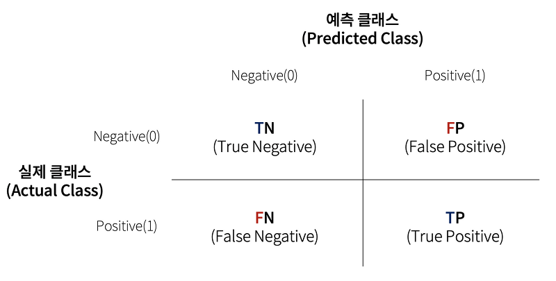

# 머신러닝 모델 평가 지표

## 오차 행렬(혼동 행렬_Confusion Matrix)
- 지도 학습의 이진 분류의 예측 오류가 어느 정도인지, 어떤 유형의 예측 오류가 발생하고 있는지 함께 나타내는 지표
- 이진 분류는 레이블의 클래스가 음성(Negative_`0`)인지, 양성(Positive_`1`)인지 예측



|예측 오류 유형|실제 결과|ML 알고리즘이 예측한 결과값|예측 성능|
|---|---|---|---|
|True Positive, TP|양성|양성|잘 예측(정답 데이터와 일치)|
|True Negative, TN|음성|음성|잘 예측(정답 데이터와 일치)|
|False Positive, FP|음성|양성|잘못 예측(정답 데이터와 불일치)|
|False Negative, FN|양성|음성|잘못 예측(정답 데이터와 불일치)|

- `TP` : 실제 정답 데이터가 양성일 때, ML 알고리즘이 양성으로 잘 예측한 것
- `TN` : 실제 정답 데이터가 음성일 때, ML 알고리즘이 음성으로 잘 예측한 것
- `FP` : 실제 정답 데이터가 음성일 때, ML 알고리즘이 양성으로 잘못 예측한 것
- `FN` : 실제 정답 데이터가 양성일 때, ML 알고리즘이 음성으로 잘못 예측한 것

## 정확도(Accuracy)
```
정확도 = 예측 결과가 동일한 데이터 건수 / 전체 예측 데이터 건수
```
- 직관적으로 모델 예측 성능을 나타내는 지표
- 이진 분류 알고리즘의 경우 데이터의 구성에 따라 ML 모델의 성능을 왜곡할 수 있다.
  - 특히, 불균형한(imbalanced) 레이블 값 분포의 경우 정확도는 모델의 성능을 판단할 적합한 판단 지표가 아니다.
- 따라서 모델의 성능을 판단할 때, 정확도 하나의 지표로만 평가하지 않는다.
 
```
정확도 = (TP + TN) / (TP + TN + FP + FN)
```

```python
from sklearn.datasets import load_breast_cancer
import pandas as pd
import numpy as np

cancer = load_breast_cancer()

# 피처 데이터
data = cancer.data
# 타겟 데이터
target = cancer.target
# 피처 컬럼명 feature_names 변수에 할당
feature_names = cancer.feature_names

# 데이터프레임 생성
df = pd.DataFrame(data=data, columns=feature_names)
# 데이터프레임에 타겟 데이터에 대한 컬럼명 및 데이터 추가
df['target'] = target
```
- `load_breast_cancer` : 사이킷런에서 제공하는 유방암 데이터
  - 타겟 데이터가 암일 경우 0, 암이 아닐 경우 1로 되어 있음

```python
tumor = df.loc[df['target'] == 1].copy()
cancer = df.loc[df['target'] == 0].copy()

tumor['target'] = 0
cancer['target'] = 1

# 샘플로 모델에 넣을 데이터 생성
sample = pd.concat([tumor, cancer[:30]], sort=True)
```
- ML 모델의 예측 결과값이 암일 경우 1로 나오도록 하기 위해서 타겟 데이터를 복사해 임의로 수정해 주었다. 
-`pd.concat` : 데이터프레임을 병합해준다. 열 방향 병합이 기본값이다.
- 불균형한 레이블 데이터 세트를 확인하기 위해 종양(0) 데이터는 357개, 암(1) 데이터는 30개만 사용한 `sample` 데이터 생성

```python
# 원하는 개수로 데이터가 잘 나눠졌는지 확인
sample['target'].value_counts()
```
```python
0    357
1     30
Name: target, dtype: int64
```
- 0(종양)데이터가 357개, 1(암) 데이터가 30개로 잘 나눠졌는지 확인할 수 있다.

```python
## 데이터 분할
from sklearn.model_selection import train_test_split
X_train, X_test, y_train, y_test = train_test_split(
    sample.drop("target", axis=1),
    sample['target'],
    random_state=42

## LogisticRegression 클래스 활용해서 모델 객체 생성
from sklearn.linear_model import LogisticRegression
model = LogisticRegression(max_iter=10000)

# 모델 학습
model.fit(X_train, y_train)

# 테스트 피쳐 데이터에 대해 예측
Ir_pred = model.predict(X_test)

## 모델의 예측 정확도(Accuracy) 확인
from sklearn.metrics import accuracy_score
accuracy_score(Ir_pred, y_test)
```
```python
0.9690721649484536
```
- `accuracy_score(<ML 모델의 예측값>, <테스트 데이터의 레이블 데이터>)` : 모델의 예측 정확도에 대한 점수를 반환한다.
- 모델의 정확도는 약 96.9%로 나쁘지 않은 수치로 보일 수 있다.


## 정밀도와 재현율
### 정밀도(Precision)
```
정밀도 = TP / (FP + TP)
```
- ML 알고리즘이 Positive로 예측한 데이터 중 실제 값이 Positive로 일치한 데이터의 비율
- 실제 정답 데이터는 Negative인데 Positive로 잘못 예측한 경우가 많으면, 즉 `FP`**의 값이 커지면 정밀도가 내려간다.**

```python
from sklearn.metrics import precision_score

precision_score(테스트 데이터 세트의 실제 결과값, 모델이 예측한 결과값)
```
- 사이킷런의 `sklearn.metrics` 패키지의 `precision_score` 함수로 모델의 정밀도를 계산할 수 있다.

### 재현율(Recall)
```
재현율 = TP / (FN + TP)
```
- 실제 값이 Positive인 데이터 중 예측과 실제 값이 Positive로 일치한 데이터의 비율
- 실제 정답 데이터는 Positive인데 Negative로 잘못 예측한 경우가 많으면, 즉 `FN`**의 값이 커지면 정밀도가 내려간다.**
- 재현율은 실제 데이터의 양성 비율을 의미하여 TPR 이라고도 한다.

- 사이킷런의 `sklearn.metrics` 패키지의 `recall_score` 함수로 모델의 정밀도를 계산할 수 있다.

```python
from sklearn.metrics import recall_score

recall_score(테스트 데이터 세트의 실제 결과값, 모델이 예측한 결과값)
```
### 정밀도와 재현율의 상대적 중요도
정밀도와 재현율은 업무의 특성에 따라 상대적 중요도를 다르게 설정할 수 있다.

1. 정밀도(Precision)가 상대적으로 더 중요한 지표인 경우
   - 서비스에서 `FP`의 상황일 때 업무상 큰 영향이 발생하는 경우
   - ex. (스팸이 맞으면(P) 메일을 삭제하는)스팸 메일 기능
   - `FP`을 줄여야 정밀도를 높일 수 있다.

2. 재현율(Recall)가 상대적으로 더 중요한 지표인 경우
   - 서비스에서 `FN`의 상황일 때 업무상 큰 영향이 발생하는 경우
   - ex. 암 진단, 금융 사기 판별 등
   - `FN`을 줄여야 정밀도를 높일 수 있다.

> ※ [참고] 불균형한 레이블 클래스를 가지는 이진 분류 모델의 경우
> - 많은 데이터 중에서 **중점적으로 찾아야 하는 매우 적은 수의 결과값**에 **Positive(1)를 설정**한다.

### 정밀도/재현율 트레이드 오프(trade-off)
정밀도와 재현율은 **상호 보완적인 지표**이기 때문에, 어느 한쪽을 강제로 높이면 다른 하나의 수치는 떨어지기가 쉽다. 이를 정밀도/재현율 트레이드 오프라고 한다.

- 정밀도 $\uparrow$ 재현율 $\downarrow$
- 정밀도 $\downarrow$ 재현율 $\uparrow$

분류하려는 업무의 특성상 정밀도 또는 재현율이 특별히 강조돼야 할 경우 분류 결정 임계값(Threshold)를 조정해 정밀도 또는 재현율의 수치를 높일 수 있다. 즉, **Threshold를 조정해 정밀도/재현율 트레이드 오프**시킬 수 있다.

똑같은 데이터와 ML 알고리즘을 사용하면 언젠가 ML 모델의 성능을 높이는데 한계가 발생한다. 그렇기 때문에, **한계점이 온 ML 모델에 대해 개발자가 원하는 방향으로 모델을 해석할 수 있도록** 잘못 예측한 결과값(`FP`, `FT`)를 thredshold를 변화시켜 정밀도/재현율 트레이드 오프하는 것이다.

- 사이킷런의 머신러닝 알고리즘 클래스의 매개변수로 thershold 값을 지정할 수 있다.
- thershold 기본값은 0.5이다. 0부터 1사이의 임의의 값을 지정할 수 있다.

### `predict_proba()` 메소드
```python
<Classifer객체>.predict_proba(X_test)
```

- 사이킷런 `Estimator` 클래스의 `predict_proba()` 메소드를 활용하면 임의로 지정한 threshold에 따른 양성 예측 확률을 반환한다.
- threshold 수치를 넘어가면 Positive로 예측한다.
- threshold 수치를 변화시켜 양성 예측 확률의 변화를 확인해 업무 특성에 맞는 정밀도/재현율 트레이드 오프할 수 있다. 
  - threshold를 낮추면 Positive로 예측될 확률이 커지게 된다. `FN`이 낮아지기 때문에 재현율이 높아지게 된다.
  - threshold를 높이면 Negative로 예측될 확률이 커지게 된다. `FT`가 낮아지기 때문에 정밀도가 높아지게 된다.
- `Classifier` 클래스 객체에서 호출이 가능

- 정밀도를 100%로 만들려면 `FP=0`이 되도록 thredshold 수치를 점점 높여보면서 확실한 기준이 되는 경우만 Positive로 예측하고 나머지는 모두 Negative로 예측한다.
- 재현율을 100%로 만들려면 `FN=0`이 되도록 thredshold 수치를 점점 낮춰가면서 모든 데이터를 Positive로 예측한다.
- 업무 특성을 고려해 정밀도 혹은 재현율이 100%인 모델보다는 적당한 threshold를 정해야 한다. 

### F1 Score

$$F1 = \frac{2}{(\frac{1}{\text recall})+(\frac{1}{\text precision})}$$

- 정밀도와 재현율을 결합한 지표
- 정밀도와 재현율이 어느 한쪽으로 치우치지 않는 수치를 나타낼 때 상대적으로 높은 값을 가지게 된다.
- 즉, 정밀도와 재현율의 균형정도를 확인할 수 있는 지표이다.
- 정밀도와 재현율이 균형될 수록 우수한 F1 Score를 갖을 뿐, F1 Score 평가 지표만으로 모델이 우수하다고 판단하기는 어렵다.